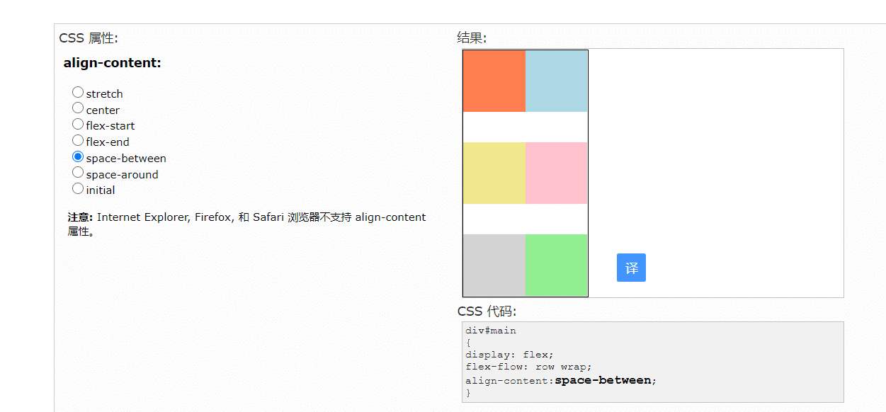

[toc]
##前言
- css就是对html的一种设计，修饰，布局其中我认为最为重要的是布局

## 选择器

## 单位
- **px**
   px就是pixel的缩写，意为像素。px就是一张图片最小的一个点，一张位图就是千千万万的这样的点构成的，比如常常听到的电脑像素是1024x768的，表示的是水平方向是1024个像素点，垂直方向是768个像素点。

- **em** 
相对于父元素的大小

- **vw**
    css3新单位，viewpoint width的缩写，视窗宽度，**1vw等于视窗宽度的1%**。
举个例子：浏览器宽度1200px, 1 vw = 1200px/100 = 12 px。
- **vh**
    css3新单位，viewpoint height的缩写，视窗高度，1vh等于视窗高度的1%。
举个例子：浏览器高度900px, 1 vh = 900px/100 = 9 px。

- 

- 

- 

- 
## 字体
- 

## 表格&边框

## 列表

## 背景

## 盒子模型

## 布局 
### flex
- 弹性布局默认值是 将元素按行排列 而且排列的时候会预备空间
- flex-direction: row | row-reverse | column | column-reverse;将元素按行，按行反向排列。。。 
- flex-wrap : nowrap | wrap | wrap-reverse; wrap 换行，从上向下排 wrap-reverse 换行，从下向上排
- 
属性	描述
display	指定 HTML 元素的盒子类型
flex-direction	指定弹性盒子中子元素的排列方式
flex-wrap	设置当弹性盒子的子元素超出父容器时是否换行
flex-flow	flex-direction 和 flex-wrap 两个属性的简写
- justify-content	设置弹性盒子中元素在主轴（横轴）方向上的对齐方式,也就是横向对齐，justify-content: flex-start | flex-end | center | space-between | space-around | space-evenly; 沿着开头/结尾/中间对齐 
space -between 

align-items	设置弹性盒子中元素在侧轴（纵轴）方向上的对齐方式
align-content	修改 flex-wrap 属性的行为，类似 align-items，但不是设置子元素对齐，而是设置行对齐
order	设置弹性盒子中子元素的排列顺序
align-self	在弹性盒子的子元素上使用，用来覆盖容器的 align-items 属性
flex	设置弹性盒子中子元素如何分配空间
flex-grow	设置弹性盒子的扩展比率
flex-shrink	设置弹性盒子的收缩比率
flex-basis	设置弹性盒子伸缩基准值
### position

## 继承

## 伪类和伪元素
- 伪类是元素有一个特定状态时（如鼠标点击），会获得特定的样式，样式改变后（如点击过后） 失去样式恢复原状的一种类型
### 所有伪类

- link：鼠标未点击前的样子
- visited : 鼠标点过以后 但是a包含了link和visited
- hover就是鼠标放上去的状态
- focus：就是输入框的时候的一些状态，比如说text文本框里面的背景

- :after 在指定元素后面插入内容 
- 如 p:after 
    content : "" url = 
    font-size,color
    background:
- before 同理

- first-child  = nth-child(1) 表示更改第一个子元素的样式
 如 p:first-child
- nth-child()父元素的第几个儿子

