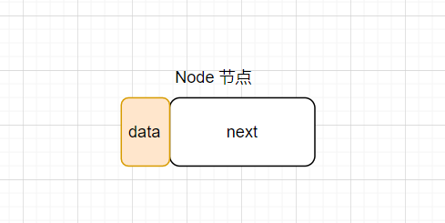
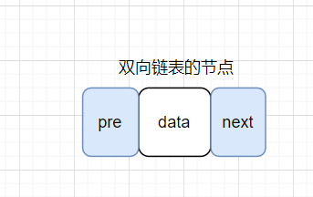
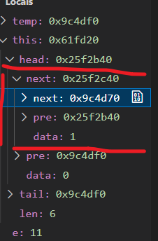
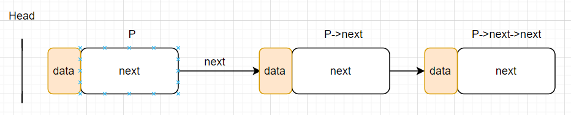
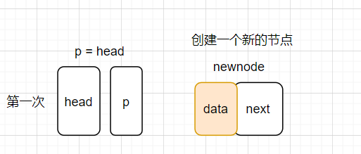
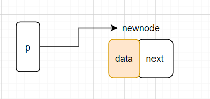
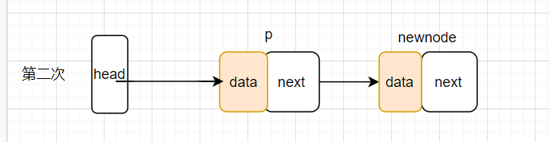
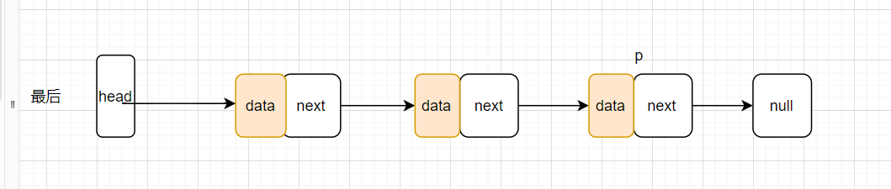

[toc]

## 链表的理解

- 常用的链表分为单链表，双向链表，循环链表，双向循环链表

### 链表的组成

链表由一个个节点通过 next 指针指向连接而成。
**节点的构造**

- **单链表的节点**
  
  单链表的一个节点由两个指针域组成，data 域，和 next 域。data 域存放的是该节点的数据，而 next 域将用来指向下一个节点的地址。
- **双链表的节点**
  
  双链表的一个节点由三个指针域组成，pre，next，data。
  pre 指针指向该节点的前驱节点，next 的指针指向该节点的后继节点
  **节点的实现**
  节点的实现方法，可以在类外模板定义节点结构体，但是建议在链表类里面使用，这样不用每次都写模板的"Node<T>"
  为什么是 next 指针是 Node 类型呢？
  **因为 next 指向的是下一个节点域，其中也包含着 next，和 data，所以是个类指针。可以理解为他指向的是下一个抽屉,也包含着 next 和 data**
  
  ```C++ {.line-numbers}
  template<typename T>
  struct Node
    {
        T data;     //当前结点的值
        Node *next;
    };
  ```
  用 class
  ```C++ {.line-numbers}
  template<typename T>
  class Node
    {
    public:
        T data;
        Node *next;
    };
  ```
  为什么常用的是 struct 而不是 class 呢，在 c++里其实两者是没什么区别的，**struct 是阉割版的 class，不能定义成员函数，数据成员都是 public。用 struct 单纯是为了储存节点数据罢了，不需要做什么事情**具体看[这篇](https://zhuanlan.zhihu.com/p/47808468)

**头结点**
我们通常会定义一个头结点来表示链表的开始，头结点是不存数据的,可以理解为数轴的 0，有头结点只是为了方便我们定义和管理链表。

Head->next 才表示第一个节点元素

- 插播一下 malloc 的用法

```C++ {.line-numbers}
int *p;
p = (int*)malloc(sizeof(int));
p = (int*)malloc(sizeof(15));
```

## 单链表的实现

基本成员函数

```C++ {.line-numbers}
template <typename T>
class List
{
private:
    class Node
    {
    public:
        T data;
        Node *next;
    };
    Node *head;
    int length;
public:
    List();
    List(T*a,int len);
    void create_List();
    void show_List();
    void insert_ele(T e,int index);
    void delete_ele(int index);
    Node *find_ele(int index);
    int find(int index);
    void reverse();
};
```

### 单链表的初始化及析构

初始时，让 head 指向空，head 的数据为 0
拷贝构造函数其实就是创建链表，具体实现看下面创建链表。

```C++ {.line-numbers}
List()
    {
        head = new Node;
        head->data = 0;
        head->next = nullptr;
    }
List(T *a,int len)
    {
        Node *p = head; //先得到头节点
        for (int i = 1; i <= len; i++)
        {
            Node *pnew = new Node; //先new一个新的节点
            pnew->data = a[i];        // 新节点赋值
            pnew->next = nullptr;  //新节点的下一个节点的地址赋值为空
            p->next = pnew;        // p的next指针指向下一个节点。
            p = pnew;              // 节点更替
        }
        p->next = nullptr;
        length = len;
    }
```

### 创建单链表

**创建的原理**
我们先 new 一个头结点，然后用一个节点 p 来=头结点，这样方便操作。
然后我们 new 一个新的节点，然后再将 p->指向新的节点，最后 p 等于这个节点，就完成了第一个节点的创建，以此类推。
**图解**
第一次


第二次

以此类推到最后

**代码**

```C++ {.line-numbers}
void Create_list(int size) //创建链表的好理解版本
    {
        Node *p = head; //先得到头节点
        for (int i = 1; i <= size; i++)
        {
            Node *pnew = new Node; //先new一个新的节点
            pnew->data = i;        // 新节点赋值
            pnew->next = nullptr;  //新节点的下一个节点的地址赋值为空
            p->next = pnew;        // p的next指针指向下一个节点。
            p = pnew;              //因为pnew 的地址是new出来的地址，p = pnew 表示，将此时头结点的地址，指向了第i个节点的地址。
        }
        p->next = nullptr;
    }
```

### 反转单链表

- 实现原理

因为单链表没有后继和前驱，所以操作起来比较麻烦，要用一个节点来储存前驱，一个节点来储存后继，然后还要特判一些情况
[img](imgg/list/list.jpg)

- 代码

```C++ {.line-numbers}
 void reverse()
    {
        Node *p = head->next;
        Node *pp = head->next->next;
        cout << " head-next " << p << " head->next->next " << pp << endl;
        Node *after = head->next->next;
        Node *cur = head->next;
        Node *t = nullptr;
        cout << " cur " << cur << " head: " << head << endl;
        while (after)
        {
            t = after->next;   // 获取当前节点的后一个节点 3 null
            after->next = cur; // 下一个节点指向当前的节点 2->1
            cur = after;       // 当前节点等于下一个节点 1=>2=>3
            after = t;         // 下一个节点等于下下个节点 2=>3 null
            cout << cur << endl;
        }
        cout << " cur " << cur << " head: " << head << endl;
        cout << " head-next " << p << " head->next->next " << pp << endl;
        head->next->next = nullptr; // 特判，让第1个节点的下一个节点指向空 因为我们是从第一个节点开始操作的，原本第一个的节点还指向第二个节点 如果不特判 第一个节点指向第二个节点，然后第二个节点指向第一个节点，就死循环了
        head->next = cur;           // 让头指向尾
    }
```

## 双链表的实现

## 循环双链表的实现

**特点**

###
