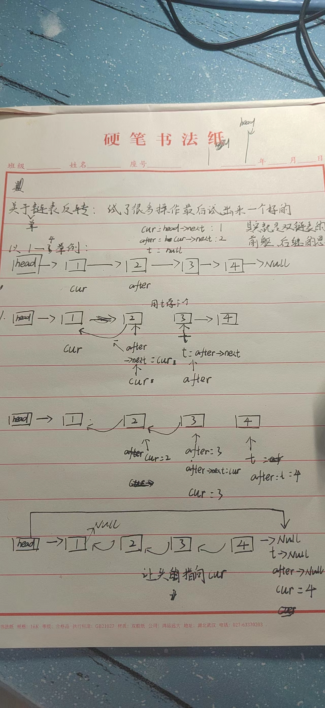

## 链表的理解

- 插播一下 malloc 的用法

```C++ {.line-numbers}
int *p;
p = (int*)malloc(sizeof(int));
p = (int*)malloc(sizeof(15));
```

## 单链表的实现

### 反转单链表

- 实现原理

因为单链表没有后继和前驱，所以操作起来比较麻烦，要用一个节点来储存前驱，一个节点来储存后继，然后还要特判一些情况


- 代码

```C++ {.line-numbers}
 void reverse()
    {
        Node *p = head->next;
        Node *pp = head->next->next;
        cout << " head-next " << p << " head->next->next " << pp << endl;
        Node *after = head->next->next;
        Node *cur = head->next;
        Node *t = nullptr;
        cout << " cur " << cur << " head: " << head << endl;
        while (after)
        {
            t = after->next;   // 获取当前节点的后一个节点 3 null
            after->next = cur; // 下一个节点指向当前的节点 2->1
            cur = after;       // 当前节点等于下一个节点 1=>2=>3
            after = t;         // 下一个节点等于下下个节点 2=>3 null
            cout << cur << endl;
        }
        cout << " cur " << cur << " head: " << head << endl;
        cout << " head-next " << p << " head->next->next " << pp << endl;
        head->next->next = nullptr; // 特判，让第1个节点的下一个节点指向空 因为我们是从第一个节点开始操作的，原本第一个的节点还指向第二个节点 如果不特判 第一个节点指向第二个节点，然后第二个节点指向第一个节点，就死循环了
        head->next = cur;           // 让头指向尾
    }
```

## 双链表的实现

## 循环双链表的实现

**特点**

###
