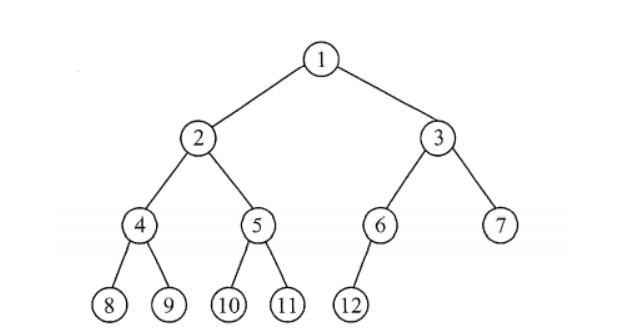

[toc]

## 树的基本概念

### 树的定义

官话：
**树（Tree）是 n（n≥0）个节点的有限集。**
树的递归定义如下：

- 当 n=0 时，T 称为空树；
- 当 n>0 时，T 是非空树。
  在一棵非空树中：
  **（1）有且仅有一个特定的节点，它只有后继节点，没有前驱节点，这个节点称为根（Root）；**
  **（2）当 n>1 时，除根以外的其余节点分为 m(m>0)个互不相交的有限集合 T1，T2，…Tm 其中每一个集合本身又是一棵树，并且称之为根的子树（SubTree）**

我的理解：
空树就是只有一个根节点，没有任何的子节点，子树。
而非空数就是有且只有一个根节点，而且最少有一个子节点。
**如图所示**

(a)是一颗空树，毛都没有
(b)是只有一个根的树，对虽然他光秃秃的，但还是树

### 树的一些术语

- 根没有前驱只有后继，所有子树的最终指向。
- **节点** 树中的每个元素对应一个节点。节点包含数据项及若干指向其他节点的分支
  在示例图中，ABCDEF 都是节点，总共有 16 个节点
- **叶子节点** 度为 0 的节点，就是没有子树的节点。F,G,I,L,M,N,O,P 都是叶子节点
- **节点的度** 节点的度表示的是节点拥有子树的个数，比如说，B 的度为 2，根节点 A 的度为 3
- **父母节点**，如图所示，B 的父节点是 A，E 的父节点是 B，K 的父节点是 E 那么 B 就是 K 的祖宗节点。
- **祖宗节点** 从根遍历到指定节点一路上经过的节点都是他的祖宗节点比如说，K 的祖宗节点为 E B A
- **兄弟节点** 兄弟节点表示在一个父节点下的相邻的节点。比如说，在 B 下，E，F 是兄弟节点，在 A 下 B C D 是兄弟节点
- **节点的层次** 节点的层次是相对于根的继承关系来说的，比如说，根节点 A 的层次为 1，根节点的子节点的层次为 2，根节点子节点的子节点的层次为 3 以此类推，像 K L M N 的层次为 4，O P 的层次为 5

- **堂兄弟节点** 在同一层次不同父母的成为堂兄弟节点比如说图中的 E F G H I 他们都属于第三层，但是他们不同父母

- **树的深度** 树的深度表示离根节点最远的节点的层次，例图的树的深度就为 5

- **树的高度** 树的高度和深度的大小一样，计算方式不一样，树的高度是很好理解，比如说，一棵高度为 3 的树，他的根节点为 h = 3，而他的深度来算的话，根节点 depth = 0;是相反的

### 树的性质

### 树的储存结构

- 以该图为例
  
- **孩子兄弟表示法**
  该表示法的一个节点包括 数据，该节点的第一个孩子已经右兄弟，这些东东如果存在就是唯一的。
  
- 通过这种方法，可以把树变成一种类似于二叉树的东西
  

## 二叉树

### 二叉树的定义

- **二叉树的定义**
  二叉树指的是指每个节点最多有两个孩子的树这个是核心定义，就是说哪怕只有一个节点，只有一个孩子，那 tm 也是个二叉树
  

### 二叉树的性质

一. 假设二叉树的深度为 n，那么二叉树的所有节点和为 $2^{n}+1 $ 例如二叉树的深度为 4，那么二叉树的所有节点和为 15。
同样的，已知二叉树的所有节点数可以推出树的深度,设所有节点数为 m，深度为H，$ H = \log_2m-1 $
二.

### 特殊的二叉树

- **斜树**
  所有的结点都只有左子树的二叉树叫左斜树。所有结点都是只有右子树的二叉树叫右斜树。这两者统称为斜树。
- **严格二叉树**
  严格二叉树指的是，所有的节点的孩子个数为 0 或为 2
- **满二叉树**
  即一颗深度为 n 的数，他的节点满了了，即拥有$2^{n+1}-1$个节点的树称为满二叉树，满二叉树定是完全二叉树，旦完全二叉树不一定是满二叉树
- **完全二叉树**
  
  一颗二叉树，0—n 层的节点都满，如果最下面一层节点不满(都是叶子节点)，则所有的节点**在左边的连续排列**，空位都在右边。这样的二叉树就是一棵完全二叉树。
- **二叉搜索树 BST**
  我们常用的几种储存数据的容器，数组，链表等，数组的遍历,插入，查找的时间复杂度是 O(n), 链表的插入时间复杂度是 O(1),但删除和查找还是 O(n); 用 sort 查找，时间复杂度是 O(1) 别的一样，于是二叉搜索树这时候出现了。
  理想的二叉搜索树的每一个操作都是 O(1)
  二叉搜索树的左子树和右子树都是二叉搜索树，而且保证左子树一定小于右子树，且左子树的每一个节点都要小于根，右子树的每一个节点都要大于根，和左子树。
  右子树的每一个左子节点也要小于右子节点。
  遵守这样的规则的树，被称为二叉搜索树。

- **平衡二叉树 AVL**
  一颗二叉树，左右子树的高度差最多为 1，而且他一定是一颗二叉查找/搜索树
  

## 二叉树的实现

### 二叉树的遍历

#### 前，中，后序遍历

[这个视频讲的非常非常好](https://www.bilibili.com/video/BV1Fv4y1f7T1/?p=34)
**二叉树的遍历有两种方式**

一种是广度优先遍历（breadth first），即访问完每一层级的所有节点才会进入到下一层级。原理是队列
如图所示，按照层级遍历的遍历结果是 `F D J B E G K A C I H`

一种是深度优先遍历（depth first），即从根开始，递归遍历左子树或右子树。一直遍历到树的最深层，访问所有的节点。原理是栈。
常用的使用深度优先遍历树的方法有三种，**前序遍历，中序遍历，后序遍历。**
**三种遍历方式的区别在于访问节点的顺序不同**

- 前序遍历 访问节点的顺序是**根 左 右**
- 中序遍历 访问节点的顺序是**左 根 右**
- 后序遍历 访问节点的顺序是**左 右 根**


后续的遍历都将以这棵树为示例。
**前序遍历**

前序遍历访问顺序是 根左右

我们的前序遍历的实现代码如下

```C++ {.line-numbers}
void pre_order(Node *root)
    {
        if (root == nullptr)
        {
            cout << endl;
            return;
        }
        cout << root->data << " ";
        pre_order(root->left);
        pre_order(root->right);
    }
```

下面让我们来结合图例和描述来理解

**首先，一开始从根开始，我们调用递归，第一次调用 pre_order(200)，第一次打印了根节点 `F`，然后 pre_order(200)就会被挂起，递归调用他的左子树，也就是 pre_order(150)。然后压入栈底，然后直到后续的程序都执行完了他才会继续执行。以下同理。
调用 pre_order(150)，打印 `D` 然后继续调用他的左子树 pre_order(400)，然后就继续打印 `B` 然后调用他的左子树 pre_order(250)，打印 `A`然后继续调用他的左子树。
这个时候，因为 `A `已经是叶子节点了，没有子节点，整个递归也已经到了树的最底部，调用他的左子树，也就是调用 pre_order(0) 这时候到了递归的终止条件了，递归开始回溯，也就是会一级级的出栈。**

- **此时栈区是这样的**

  

- **回溯部分**
  **首先回溯到了 pre_order(250)，因为` pre_order(root->left)`已经调用过了，所以他会调用`pre_order(root->right)`** 而他的右子树也是空，所以程序会继续回溯到上一级，也就是 pre_order(400)，而 pre_order(400)的右儿子没有调用过，而且不为空，这时就调用 pre_order(180) 打印 `C` 然后同理，最后会回到 **pre_order(150)**

- 

- 

回溯到 pre_order(150)后，他又会按照之前的流程调用 pre_order(450)，输出`E` 最后回到根节点，以同样的方式递归遍历右子树。

**最后的遍历结果**
`F D B A C E J G I K `

- **中序遍历**
  和前序的原理都是一样的，不过是左 根 右
- **这里直接贴代码和结果**
  `A B C D E F G I J K`

```C++ {.line-numbers}
void mid_order(Node *root)
    {
        if (root == nullptr)
        {
            cout << endl;
            return;
        }
        mid_order(root->left);
        cout << root->data << " ";
        mid_order(root->right);
    }
```

- 我们可以看到，他和前序遍历的不同在于打印元素的位置发生了变化，比如说，左根右，递归先遍历完所有的左子树，再回溯输出。

- 

#### 层序遍历

**利用了队列**

#### 前中后序遍历非递归版

**前序遍历**

- 原理：
  我们知道，递归的本质就是栈，那么我们可以利用 stack，来模仿递归遍历，栈的流程从而达到不用递归来实现遍历。

前序遍历，还是以该树为例

**思路**：
前序遍历是先遍历左子树，再遍历右子树的，在递归中，遍历右子树的方法是回溯。而我们的非递归遍历无法实现回溯，那我们要做的，就是，**把右子树先压到栈底，最后再出栈**。
**代码实现**

```C++ {.line-numbers}
void pre_order()
    {
        Node *p = root;
        stack<Node *> k;
        k.push(p);
        while (!k.empty())
        {
            p = k.top();
            k.pop();
            cout << p->data << " ";
            //
            // 按照递归的方法，前序遍历是把左子树都遍历完了才回溯的，回溯遍历右子树，但是用栈我们无法表达回溯，所以可以先把右子树压入栈底，后面再出栈
            if (p->right != nullptr)
            {
                k.push(p->right);
            }
            if (p->left != nullptr)
            {
                k.push(p->left);
            }
        }
    }
```

### 二叉树的插入，删除

### 二叉树的查找

### 通过先序遍历和中序遍历构建一棵二叉树

- **原理**
  前序遍历的第一个元素一定是根节点，而中序遍历的话，根节点在中间。我们可以通过二分的方式根据这个规则，动态的创建一棵二叉树
- 例
  **前序遍历**：`A B C D E`
  **中序遍历**: `C D B A E`
  一开始，我们可以先遍历前序序列，然后找到根，再在中序中，找到根，那么在中序序列中，他的左边就是树的左子树，右边就是右子树。再前序递归遍历就能动态创建了。
  如图所示
  
  那根据图例我们也能看出，想实现我们的操作，那首先，得需要递归的变量前序序列，然后在中序中找到和前序相同的元素，然后再递归的生成左子树和右子树。

- **代码实现**

```C++ {.line-numbers}
Node *pre_increate(vector<T> pre, vector<T> in, int left, int right)
    {

        static int cnt = 0; // 静态指针可以表示递归的次数，并且可以再每次递归中移动。
        if (left >= right)
        {
            return nullptr;
        }
        Node *p;
        // int cnt = 0;
        // T value = pre[cnt++];
        if (left < right)
        {
            T value = pre[cnt]; // 每次后移一次cnt
            int i = left;
            while (pre[cnt] != in[i] && i < right)
            {
                i++;
            }
            ++cnt;
            p = new Node(value);
            p->left = pre_increate(pre, in, left, i); // 递归的创造左边，也就是
            p->right = pre_increate(pre, in, i + 1, right);
        }
        return p;
    }
    void pre_increate(vector<T> pre, vector<T> in)
    {
        int left = 0;
        int right = in.size();
        treelen = right;
        root = pre_increate(pre, in, left, right);
    }
```

### 通过中序遍历和后序遍历构建一棵二叉树
