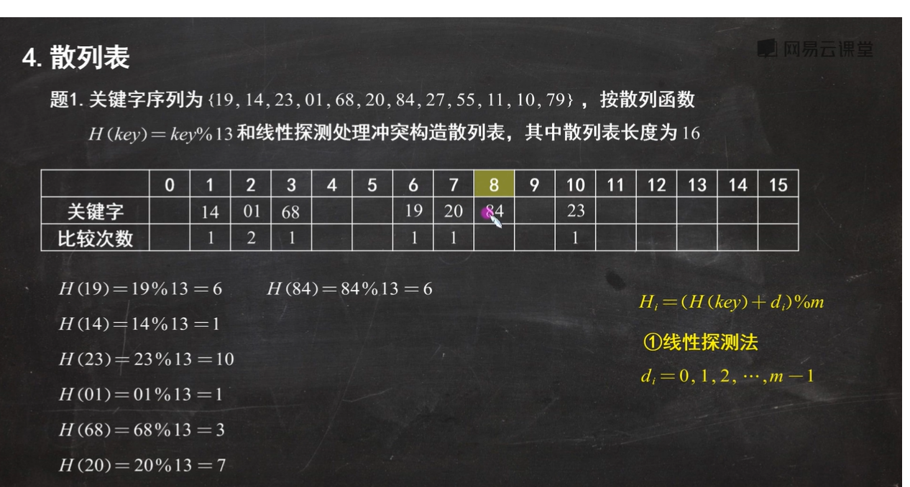

## 考试题目大纲


### 选择题

共 15 题

1. **单链表插入一个结点**
   单链表插入节点首先，要先创建一个 n 新节点，然后链表遍历到插入位置的前一个节点，前一个节点指向 newNode，newNode 指向后一个节点
   ```C++ {.line-numbers}
   void insert(T e,int index)
   {
      Node *p = head;
      for(int i = 0;i<index;i++)
      {
         p = p->next;
      }
      Node *newNode = new Node(e);
      newNode->next = p->next;
      p->next = newNode;
   }
   ```
2. xxx
3. **顺序表和链表什么时候使用**
   顺序表可以通过索引来快速访问元素，顺序表的创建很简单，但是顺序表插入删除很麻烦，还要考虑空间问题
   链表插入删除节点很简单，而且不需要考虑会不会爆的问题，但是遍历很麻烦，查找也需要从头开始
4. **栈的出栈**
   栈顶先出，后进先出
5. **AOV 的概念**
   其实就是个有向图
   定义：在一个表示工程的有向图中，用顶点表示活动，用弧表示活动之间的优先关系，这样的有向图为顶点表示活动的网，我们成为 AOV 网（Activity On Vertex Network）,AOV 网中的弧表示活动之间的某种约束关系。AOV 网中不存在回路（即无环的有向图）。
   

6. **哈希表**
   哈希表其实就是存 key 值的表，简单来说就是存下标的，通过哈希函数计算后，将 key 值存入哈希表中。
   计算方法常用的有直接定址法和除数余留法
   
   如果遇到有 key 值冲突的话，那就用开放定制法、链地址公共溢出区法、再散列法方法来。
   而开发地址发又可以分为线性探测法，平方探测法和再散列法
   
   其实很简单，如果遇到冲突了，再手动计算的情况下，你看距离他后面最近的哪个有空位直接填就好了，比较次数就是从**那个冲突的开始**，以 84 为例，冲突的是 6，然后 6，7，8，比较 3 次
7. **指针和引用的区别**
   引用的本质是直接对引用的地址操作，而指针表示的是这个的地址，相当于复制了一份
8. **稀疏矩阵的压缩存储** 稀疏矩阵，压缩，行号列号值存储，什么是相同的?
   首先稀疏矩阵的定义：在矩阵中有 s 个非零元素，s<<矩阵中的元素总数，那么就称这个矩阵为稀疏矩阵。
   稀疏矩阵如果如果使用二维数组来储存的话，因为里面有很多 0，或者就是空元素，会很占用空间，所以要压缩存储。
   常用的三种方式：三元组顺序表，行单链表，十字链表法
   用三元组压缩存储。
   三元组可以理解为一个类里面有 3 个成员，然后再放入整体的数组里面
   三元组的话表示非 0 元素所在的行列和值。如果用行单链表的方式储存的话，就是先定义一个整体的带行数和列数的单链表，然后再一个节点对于一个 3 元组
   
9. **快排**
   比较次数 与序列初态 无关 的算法是：二路归并排序、简单选择排序、基数排序
   比较次数 与序列初态 有关 的算法是：快速排序、直接插入排序、冒泡排序、堆排序、希尔排序
   排序趟数 与序列初态 无关 的算法是：直接插入排序、折半插入排序、希尔排序、简单选择排序、归并排序、基数排序
   排序趟数 与序列初态 有关 的算法是：冒泡排序、快速排序
   - **各种排序的时间复杂度**
     
10. **二叉树查找的时间复杂度**
    二叉搜索树是 O(1),二叉树是 on
11. **二叉树的性质（层次的节点数**
    $2^n+1$个节点，n 表示有第几层
12. **二分查找**
    二分的话就是经典了，时间复杂度，O(log n),然后要求一定是有序的序列
13. **快排（空间复杂度**
14. **哈希函数**
15. **图的连通性（最少多少边能联通）**
    也就是说在无向图中，两个顶点间有路径，也就是说最少一条边，那么他们就是联通的。若一个图有 n 个节点，边数小于 n-1 那么肯定是非联通的，因为哪怕是 2 个顶点，也是要至少 1 条边
    所以最少多少条边能联通的条件是 edge>=n-1
    

### 判断题

原题

自写答案


### 填空题

1. **算法的时间复杂度表示**
2. **二叉树链式存储，有 n 个节点，有多少指针**
   n-1 个指针
3. **邻接表**
   
   
   邻接表其实就是，通过数组+链表来储存图的相连通的点，指针域可以附加一个权值
4. **完全图**
5. **堆排序**
6. **排序算法的稳定性**

### 应用题

1. **画二叉搜索树**
2. **哈夫曼树**
3. **哈希表**
4. **画最小堆**
5. **画出邻接表有向图**
6. **程序填空一个二分查找（递归，非递归）**

### 程序设计题

1. **删除单链表的头结点(已知内容，第一个节点)**
2. **单链表查找(查找元素出现的次数)**
