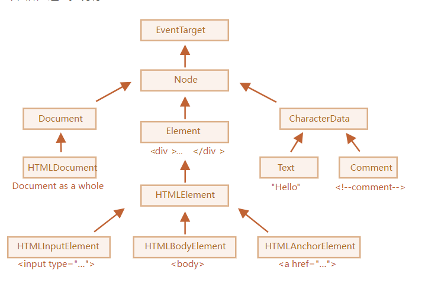

[toc]

## js 基础

### 输出 执行语句从上到下

输出数据：

- 使用 `window.alert()` 弹出警告框。刷新一次网页就弹一次
- 使用 `document.write()` 方法将内容写到 HTML 文档中。
- 使用 `innerHTML` 写入到 HTML 元素。
- 使用 `console.log()` 写入到浏览器的控制台。

### 数据类型

```js {.line-numbers}
let length = 16; // Number 通过数字字面量赋值
let points = x \* 10; // Number 通过表达式字面量赋值
let lastName = "Johnson"; // String 通过字符串字面量赋值
let cars = ["Saab", "Volvo", "BMW"]; // Array 通过数组字面量赋值
let person = {firstName:"John", lastName:"Doe"}; // Object 通过对象字面量赋值
```

JSON

### js 引用

- js 可以引用外部 script 标签，外部标签内部不可修改，一般放在网页设计底部以便加载完网页加载
- 也可以在标签里通过属性引入，不过不方便维护
  ```html {.line-numbers}
  <button onclick="alert('点一下捏一下wyt的脸');">点我</button>
  ```

### 作用域

- 全局作用域，局部作用域，块级作用域

## 对象

### 对象的创建

- js 的对象，可以理解为 map，字典这样的东西，里面可以套函数，键值，也可以套对象

```js {.line-numbers}
/*套对象，套key*/
let Object = {
  key: "键值",
  myfunction: function name(params) {},
};
/*对象里的对象*/
let coverObj = {
  objj: { myname: 1, myage: 19 },
};
console.log(coverObj.objj.myage);
```

### 内置对象

#### 数组

#### String

#### Date

#### Math

## DOM

### 概述

- DOM 全称文档对象模型，是一个标准编程接口（api） 利用 DOM 可以改变网页的样式，内容，结构

### DOM 树

### DOM 节点类

DOM 节点的层次结构如下图


- EventTarget 是一切根的抽象类，作为一个基础让所有的节点都支持事件类
- Node 也是抽象类，然后他提供了树的核心功能
  parentNode,nextSibling等
  children —— 仅那些作为元素节点的子代的节点。
  childNodes
  firstElementChild，lastElementChild —— 第一个和最后一个子元素。
  previousElementSibling，nextElementSibling —— 兄弟元素。
  parentElement —— 父元素。
- Document 被HTMLDocument 继承，指的是整个HTML的整个文档，document 继承自这个类


#### 子节点：childNodes，firstChild，lastChild

### 选择器

- getElementById 根据 id 返回的是元素对象
- document.getElementsByTagName() 会搜索整个文件结构，包括根节点，然后会动态的改变，保持和 dom 树的一致，他是从第一个父节元素开始往下递归的在 DOM 树中搜索符合条件的元素
- document.getElementsByClassName 获取 class
- **其实 H5 以后选择器都用 querySelector 了** 前面的已经成为了时代の眼泪(bushi)
- querySelector 获取的是第一个元素。用法就是根据元素直接获取就行 比如 id 就#id class 就.class
  querySelector 还可以直接像 css 选择器那样获取元素。
  querySelectorAll 获取所有的同类元素
  ` let img4 = document.querySelector(".changstyle img");`

```js {.line-numbers}
let time = document.querySelector(".box");
console.log(time);
console.log(document.querySelector("#first"));
console.log(document.querySelector("ul")); //只会获取第一个ul
```

### 事件

- 事件由 3 部分组成————事件源，事件类型，事件处理程序。事件三要素
- **操作事件三要素可以分为 1.获取事件源，2.绑定事件，3.添加事件处理程序**

一 . **事件源 事件触发的对象 以按钮为例**

```js {.line-numbers}
<button class="btn"></button>;
let btn = document.querySelector(".btn");
```

二 . **绑定事件**
通过添加事件类型来进行绑定

- ```js {.line-numbers}
  btn.onclick;
  ```

三 . **添加事件处理程序**

- ```js {.line-numbers}
  btn.onclick = function () {
    alert("change");
  };
  ```

#### 事件类型

常用事件类型

鼠标事件

- **onclick** 点击鼠标时触发此事件
- ondblclick 双击鼠标时触发此事件
- onmousedown 按下鼠标时触发此事件
- onmouseup 鼠标按下后又松开时触发此事件
- onmouseover 当鼠标移动到某个元素上方时触发此事件
- onmousemove 移动鼠标时触发此事件
- onmouseout 当鼠标离开某个元素范围时触发此事件
- onkeypress 当按下并松开键盘上的某个键时触发此事件
- onkeydown 当按下键盘上的某个按键时触发此事件
- onkeyup 当放开键盘上的某个按键时触发此事件

键盘事件

onkeydown 某个键盘按键被按下。
onkeypress 某个键盘按键被按下并松开。
onkeyup 某个键盘按键被松开。

表单事件

- **onfocus** 元素获取焦点时触发
- **onblur 元素失去焦点时触发**
  **比如说定位了一个文本框，你点击文本框就是 onfocus 有焦点，点击文本框外部就是失去焦点 onblur**
- onchange 该事件在表单元素的内容改变时触发
- onfocusin 元素即将获取焦点时触发
- onfocusout 元素即将失去焦点时触发
- oninput 元素获取用户输入时触发
- onreset 表单重置时触发
- onsearch 用户向搜索域输入文本时触发
- onselect 用户选取文本时触发
- onsubmit 表单提交时触发

#### 事件处理程序

一.函数处理

二.修改元素

- element.innerHTML
  可以直接获取,改变 html 的元素,可加标签。不能修改表单

  ```js {.line-numbers}
  let clm = document.querySelector(".clikcmove");
  clm.innerHTML = "<strong>今天是个好日子</strong>";
  ```

- src，href,id,alt,title
  直接更改 html 里的 src，href 等标签，然后更换里面的内容

  ```js {.line-numbers}
  let img = document.querySelector(".img1");
  img.src = "../img/02.png";
  ```

- type,value,checked,selected,disabled
  更改表单的方法
  type 更改 input 的类型，比如说，text 改成 password 等
  disable 使用后可以禁用点击

  ```js {.line-numbers}
  let btn3 = document.querySelector(".btn3");
  let input = document.querySelector("input");
  input1.type = "text";
  input1.type = "password";
  btn3.onclick = function () {
    input.value = "点击咯";
    this.disabled = true; //禁用点击，点击了一次以后就不能点击了
  };
  ```

- Element.style Element.className

  直接通过 js 来更改 style 的样式

  ```js {.line-numbers}
  let changecolour = document.querySelector(".changecolour");
  changecolour.onclick = function () {
    if (flag == 0) {
      this.style.backgroundColor = "blue";
      this.style.width = "80px";
      this.style.height = "80px";
      flag = 1;
    } else {
      this.style.backgroundColor = "red";
      this.style.width = "100px";
      this.style.height = "100px";
      flag = 0;
    }
  };
  ```

  可以用 className 直接改变元素的类名，改变这个是直接覆盖，如果需要保留原来的类名，要用 css 多项选择器

  ```js {.line-numbers}
  let texxt = document.querySelector(".texxt");
  texxt.onclick = function () {
    //this.className = "change";//覆盖了原来的.texxt
    this.className = "texxt change";
  };
  ```
