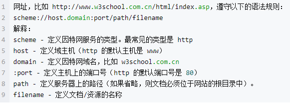
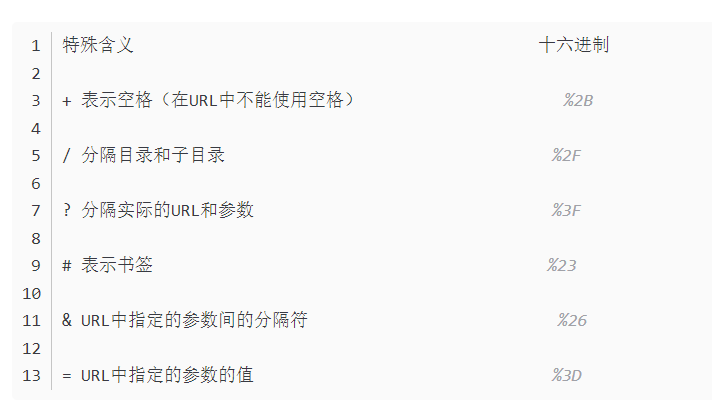
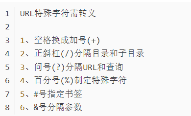
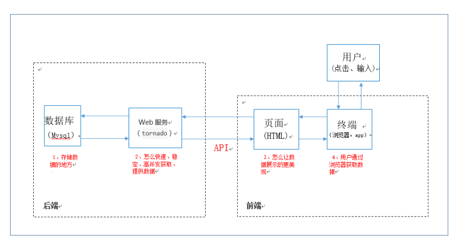
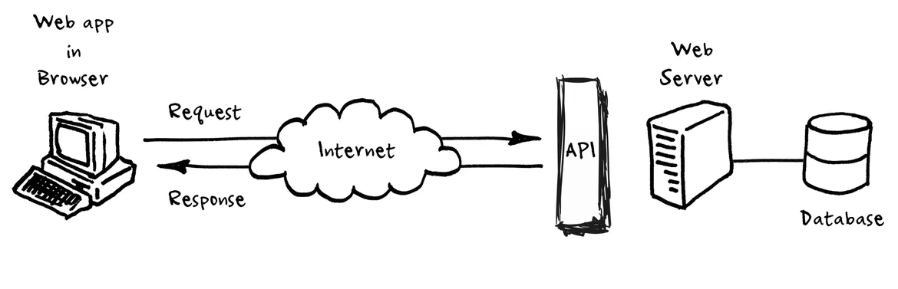

[toc]

## 大前提 关于 url 的介绍

URL - Uniform Resource Locator 统一资源定位符 即网址 即访问的目标

### URL 的组成

一个 url 的常用格式包括：
**所用协议://访问的服务器地址/服务器的文件目录/文件目录上的文件夹/目标文件**

完整格式包括：
**所用协议://用户名:密码 访问的服务器地址:端口号(默认 80)/服务器的文件目录/文件目录上的文件夹/目标文件**

- 以网址 `http://www.w3school.com.cn/html/index.php` 为例



**访问 URL 时省略**
我们经常可以见到类似于
www.bilibili.com 这样的网址 或者是 www.baidu.com/ 其实是省略了后面的文件名。

省略掉后面的文件名时 例如`https://www.bilibili.com/`，**/ 表示**的是省略后的文件夹。所以这种形式的访问的是默认的，事先在服务器上设置好的文件名。
如果 https://www.bilibili.com 这样的话连 / 都省略了，就代表，访问的根目录下设置的默认文件，即主页。
https://www.bilibili.com/wtf 如果是这种，在文件目录下没有存在 wtf.html 目录就按目录创建，存在就当成文件。

### URL 中的特殊字符

(https://blog.csdn.net/zlingyun/article/details/83536589)
(https://blog.csdn.net/u011600592/article/details/82730989)




**使用特殊字符的原因**
如果你的表单使用 get 方法提交，并且提交的参数中有“&”等特殊符的话，如果不做处理，在 service 端就会将&后面的作为另外一个参数来看待

例如
表单的 action 为 **list.jsf?act=go&state=5**。则提交时通过 **request.getParameter** 可以分别取得 act 和 state 的值。
如果你的本意是 **act='go&state=5'**这个字符串，那么为了在服务端拿到 act 的准确值，你必须对&进行转义。

**url 转义字符原理：**
将这些特殊的字符转换成 ASCII 码，格式为：**%加字符的 ASCII 码**

在 url 中空格是无法直接表示的，所以如果要打空格，可以用 + 或者用 `%20` 来表示

**URL 特殊符号及对应的十六进制值编码：**

```js {.line-numbers}


 +       URL中+号表示空格                  %2B
 空格     URL中的空格可以用+号或者编码        %20
 /       分隔目录和子目录                   %2F
 ?       分隔实际的 URL 和参数              %3F
 %       指定特殊字符                      %25
 #       表示书签                         %23
 &       URL中指定的参数间的分隔符           %26
 =       URL中指定参数的值                 %3D
```

**?**
**1、连接作用(最常用)**
**用于连接一些参数，分隔离实际的 url 和参数**

比如说 `https://cn.bing.com/search?q=url` ?后面连接的 q 就是一个参数，然后也是和原本要访问的`https://cn.bing.com/search` 分割开来

2、清除缓存

```js {.line-numbers}
http://www.xxxxx.com/index.html
http://www.xxxxx.com/index.html?test123123
```

两个 url 打开的页面一样，但是后面这个有问号，说明不调用缓存的内容，而认为是一个新地址，重新读取。

**&**
用于分割参数

```js {.line-numbers}
http://www.xxxxx.com/index.html?test123123&id=blue
```

**#**
这玩意一堆作用后面再补

## 前后端通信

前后端通信本质上就是

- 前端和后端数据交互的过程
- 浏览器和服务器直接数据交互的过程。
  前端的基本理解
  前端就是客户端，移动端，等我们作为 user 可以直接看到的页面。

### 前后端通信的过程，方式

- 前后端的通信是在请求-响应中完成的
  浏览器请求数据，而服务器返回响应数据

- 浏览器发送请求分为以下几个步骤
  对 url 进行解析

- 使用 ajax 和 fetch 进行通信

- 解析 HTML 的标签的时候遇到一些特殊的标签
  `link / img / script / iframe` 会再次向服务器发送请求
  还有 `a /form`这样的标签，浏览器解析时不会主动向服务器发送请求，但是用户可以手动发送请求。

- WebSocket

### http 协议
详见网络是怎样连接的.md


### API
#### API的基本概念
API Application Programming Interface 
简单来说就是 程序之间的接口。

这个接口，其实就像现成的工具一样，不需要我们做什么事情，我们只需要根据我们的需求，利用这个api来实现一些操作就可以了。
举个例子，我需要请人帮我做家务，我需要叫家政公司为我提供服务，在这里，家政公司就是API。 而怎么请阿姨，阿姨的打扫方法，都不是我需要考虑的。我需要做的只是，表明我的需求，她需要打扫卧室啊，什么的就可以了。
**也就是说API的实现细节，很多时候我们是不需要知道的。**

- 下图表示在前后端直接API 的作用



#### 现在API最常用的形式——以网络请求为基础的API




### cookie

