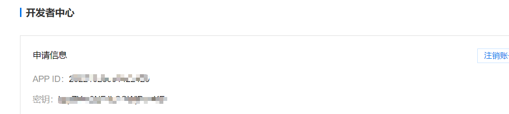
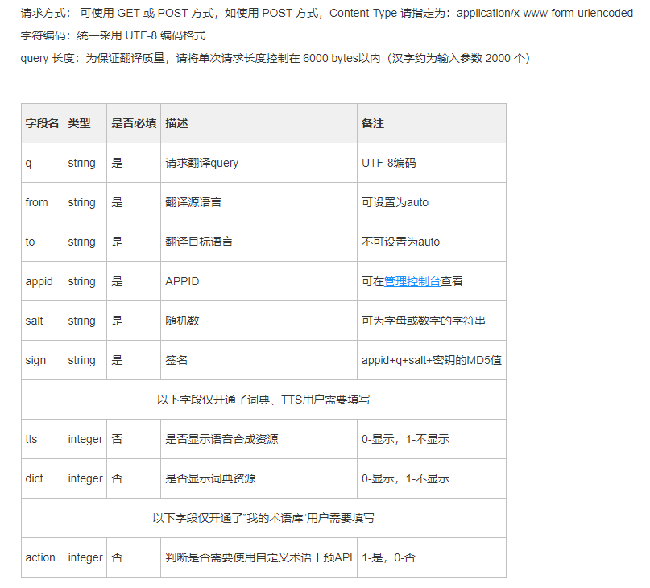
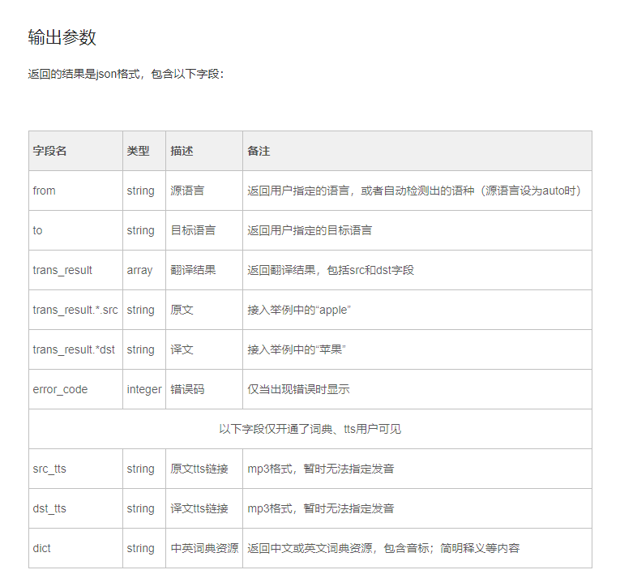

## 实现原理

- 百度翻译会给予用户一个免费的翻译 API，会提供一个 url 以及用户账号和秘钥等参数信息。然后我们就要利用这个接口向他的服务器发送请求，然后我们这边获取请求，再通过 js 就可以在网页上实现了。
- [地址](http://api.fanyi.baidu.com/doc/21)
- 参数列表
  
  
  

## 具体操作

### 构造访问URL
核心在于构造URL了，首先根据他给我们的文档，我们知道

### 通过JSONP 解决跨域访问失败的问题