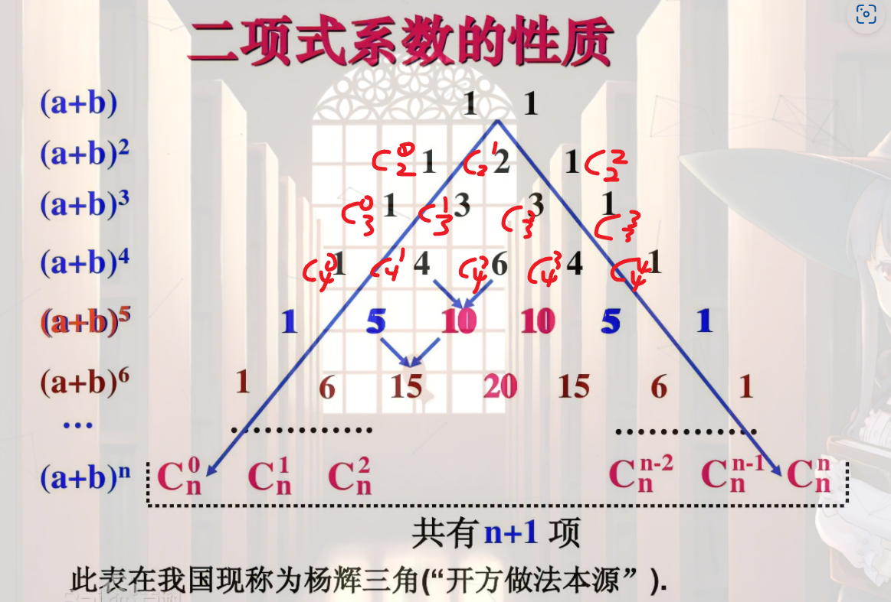

[toc]

## dfs 的理解

- dfs 本质上就是一种纯暴力的，枚举出所有可能的结果的一种思想，其本质，就是构造一棵二叉搜索树，然后根据读取树上的结果获取我们想要的信息。
- 所以，学好 dfs 首先就是对树形数据结构熟悉。

- dfs 的进阶就是如何通过剪枝来降低空间的占用，因为他的执行一般都是递归嘛，堆栈很容易爆。

## dfs 暴力枚举，排列问题，组合问题，指数型枚举

### 指数型枚举

#### 指数型枚举思路

指数型枚举其实就是，每个选项都有 0 和 1 的情况，总共有$2^n$种情况，真真正正的，把所有情况都列举出来，这种适合于那种，只有 0 和 1 的情况的，比如说上电梯，上下。然鹅实际上我们遇到这种是需要剪枝的。

#### 模板

```C++ {.line-numbers}
int n;
bool st[n+5];
int a[n+5];

void dfs(int k)
{
    if(k>n)
    {
        return;
    }
    // 选
    st[k] = 1;
    dfs(k+1);
    //不选
    st[k] = 0;
    dfs(k+1);

    // 一组数里面选不选的
    for(int i = 1;i<=n;i++)
    {
        a[k] = i;
        dfs(k+1);
        a[k] = 0;
    }
}
```

### 组合问题

#### 组合问题的实现思路

#### 组合数与杨辉三角

- 二项式系数
  二项式系数，定义为$(1+x)^n$
  展开之后 x 的系数。通常来讲，二项式系数代表的是从 n 件物品中，无序地选取 k 件的方法总数，这就是我们定义的组合数

- 二项式系数的展开
  二项式系数展开公式：$Cn^m*x^(n-k)*(-1)^k$
  $(1+x)^n
 中x^k
的系数正好等于从n
个元素中选取k
个元素的组合数（Ckn
）$
- 杨辉三角
  
  观察杨辉三角我们可以发现，其实杨辉三角的每一层都是对应他的 n 的系数的 k 的展开，然后因此我们可以得到$在(x+1)^n中，x^k的系数 = 在n中取k个组合数的个数$

- 得到递推公式
  $C[i][j]=C[i−1][j]+C[i−1][j−1];$

#### 例题

- 一. **实现几个数里面选几个数的组合**

- 例题[洛谷 P1157 组合的输出](https://www.luogu.com.cn/problem/P1157)
  牛客[递归实现组合数枚举](https://ac.nowcoder.com/acm/contest/998/B)
- 题意分析
  经典的组合模板题，

```C++ {.line-numbers}
#include <bits/stdc++.h>
using namespace std;
int a[10000], b[10000], j, n, k, sum, m;
bool v[1000];
void dfs(int u)
{ /*终止条件*/

    if (u > m)
    {
        for (i = 1; i <= m; i++)
            cout<<setw(3)<<a[i];//c++中打间隔的方式
        cout << endl;
        return;
    }
    for (int i = a[u - 1] + 1; i <= n; i+++)
    {
        a[u] = i; // 1 25
        dfs(u + 1);
    }
}
int main()
{
    cin >> n >> m;
    dfs(1);
}

```

### 排列选数问题

#### 模板

```C++ {.line-numbers}
oid dfsmei(int k)
{
    if (k > n)
    {
        for (int i = 1; i <= n; i++)
            cout << a[i] << " ";
        cout << endl;
        return;
    }
    // 用for循环是为了保证我每次能走完n个数
    for (int i = 1; i <= n; i++)
    {
        if (!st[i]) // st[i]==false
        {
            a[k] = i;
            st[i] = 1;
            dfsmei(k + 1);
            cout << "康康回溯后是不是直接走这里还是走I "
                 << "i = " << i << endl; // 是直接走这里，前一个递归栈
            st[i] = 0;
            a[k] = i;
        }
    }
}
```

#### 实现思路

#### 排列选数的实现思路

思路：我们要明白，我们想实现什么，我们要实现的是，将 n 个数中选 m 个数，然后让他们进行排列，不能有重复的数字。2.怎么避免选重复的数字，

```C++ {.line-numbers}
#include <bits/stdc++.h>
using namespace std;
typedef long long ll;
bool v[10000];
int n, m, i, j, sum = 0,k;
bool isprime(int n)
{
   for (i = 2; i <= sqrt(n); i++)
   {
      if (n % i == 0)
         return false;
   }
   return true;
}
int a[25];
long long ans;
void dfs(int m, int sum, int startx)
{   //边界条件
   if (m == k)
   {
      if (isprime(sum))
         ans++;
      return;
   }
   for (int i = startx; i < n; i++)
      dfs(m + 1, sum + a[i], i + 1);
   return;
}
int main()
{
   scanf("%d%d", &n, &k);
   for (int i = 0; i < n; i++)
      scanf("%d", &a[i]);
   dfs(0, 0, 0);
   printf("%d\n", ans);
   return 0;
}

```

### 迷宫问题

#### 解决迷宫问题的思路

#### 例题

- 解题思路,比如在一个 10x10 的迷宫里面，起始坐标是(0,0),重点是(5,4),要求找到一条最短的路
- 
- 如同所示,那么要想实现这玩意的话,就得用回溯了,在一次次的走和实验中,发现最短路

```C++ {.line-numbers}
int x, y, x1, y1, step = 0;
int minn = 999999;
int a[100][100]; // 1表示空地可走,2表示有障碍物.
int v[100][100]; // 0 表示未访问,1表示已访问,全局变量默认0
void dfs(int x, int y, int step)
{
    if (x == x1 && y == y1)
    {
        if (step < minn)
            minn = step;
        return; //开始回溯
    }
    /*顺时针运动,要明白,因为二维数组,向右移动改变的是竖列,即y在变
    /*right*/
    //判断能不能往右走
    if (a[x][y + 1] == 1 && v[x][y + 1] == 0)
    {
        v[x][y + 1] = 1; //走过就标记已访问
        dfs(x, y + 1, step + 1);
        v[x][y + 1] = 0; //等到回溯的时候,就可以用了，因为是往下走,那么你走过的点,标记为未走过就行了
    }
    /*down*/
    if (a[x + 1][y] == 1 && v[x + 1][y] == 0)
    {
        v[x + 1][y] = 0;
        dfs(x + 1, y, step + 1);
        v[x + 1][y] = 1;
    }
    /*left*/
    if (a[x][y - 1] == 1 && v[x + 1][y - 1] == 0)
    {
        v[x][y - 1] = 0;
        dfs(x, y - 1, step + 1);
        v[x][y - 1] = 1;
    }
    /*up*/
    if (a[x - 1][y - 1] == 1 && v[x - 1][y - 1] == 0)
    {
        v[x - 1][y - 1] = 0;
        dfs(x - 1, y - 1, step + 1);
        v[x - 1][y - 1] = 1;
    }
    return;
}
int main()
{
    int m, n;
    int xstart, ystart;
    cin >> m >> n;
    for (int i = 0; i < m; i++)
        for (int j = 0; j < n; j++)
        {
            cin >> a[i][j];
        }
    cin >> xstart >> ystart >> x1 >> y1;
    dfs(xstart, ystart, 0);
    cout << minn;
}
```

### dfs 标准模版题

- 对于这种题目，我的理解能力比较难以理解，就是为什么递推，一定要回溯
- 此类题目就是一个很近的
- 题目链接

```C++ {.line-numbers}
#include <bits/stdc++.h>
using namespace std;
typedef long long ll;
bool v[10000];
int n, m, i = 0, j, sum = 1, sum1, k;
int minn = 999999999;
int a[10000], b[10000];
void dfs(int u)
{
    if (u == n)
    {
        return;
    }
    else
    {
        sum *= a[u];
        sum1 += b[u];
        minn = min(abs(sum - sum1), minn);
        //cout << "minn shang : " << minn << endl;
        //cout<<"sum:shang  " <<sum << " " << sum1 << endl;
        //cout <<"u = " <<u<<endl;
        dfs(u + 1);
        sum /= a[u];
        sum1 -= b[u];
        //cout <<"xia: " <<sum << " " << sum1 << endl;
        dfs(u+1);
    }
    if(sum1==1&&sum==0)
        return;
}
int main()
{
    cin >> n;
    for (i = 0; i < n; i++)
        cin >> a[i] >> b[i];
    dfs(0);
    cout << minn;
}
```

### dfs 经典例题（杂合) 以上三种情况的

#### 一.洛谷烤鸡

[https://www.luogu.com.cn/problem/P2089]


- 样例输入

```
11
```

- 样例输出 #1

```
10
1 1 1 1 1 1 1 1 1 2
1 1 1 1 1 1 1 1 2 1
1 1 1 1 1 1 1 2 1 1
1 1 1 1 1 1 2 1 1 1
1 1 1 1 1 2 1 1 1 1
1 1 1 1 2 1 1 1 1 1
1 1 1 2 1 1 1 1 1 1
1 1 2 1 1 1 1 1 1 1
1 2 1 1 1 1 1 1 1 1
2 1 1 1 1 1 1 1 1 1
```

- 提示
  对于 $100\%$ 的数据，$n \leq 5000$。

**解题思路**
首先这题不难看出总共就 30 种调料，那么 n 不可能超过 30。
然后我们看到，1——3 种选择，那我们就要明白，这是一种组合型，那么里面一定有 for 循环。
接着我们考虑，终止条件，发现，其实只要 sum==n 的时候，就可以终止了。每次满足就计数一次
然后难点在于要输出 cnt，那我们要先将数据储存在数组里，最好的储存方法就是用 2 维数组，主对角线的方式来存 即` a[n*n][cnt]`，为什么要开那么大呢，

- AC 代码

```C++ {.line-numbers}
/*洛谷 烤鸡*/

#include <bits/stdc++.h>
using namespace std;

int n, ans[100001][11]; // n<=30
int a[11];
int sum = 0, cnt = 0;
int st[205];
void dfs(int k)
{
    if (sum > n)
        return;
    if (k > 10)
    {
        if (sum == n)
        {
            ++cnt;
            for (int i = 1; i <= 10; i++)
                ans[cnt][i] = a[i];
        }
        return;
    }
    for (int i = 1; i <= 3; i++)
    {
        a[k] = i;
        sum += i;
        dfs(k + 1);
        sum -= i;
        a[k] = 0;
    }
}
int main()
{
    cin >> n;
    dfs(1);
    cout << cnt << endl;
    for (int i = 1; i <= cnt; i++)
    {
        for (int j = 1; j <= 10; j++)
            cout << ans[i][j] << " ";
        cout << endl;
    }
    return 0;
}
```

#### 2.奇怪的电梯
