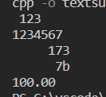

[toc]

## stringstream

- 由于 to_string 是 c++11 的,面对不能用 to_string 的时候可以用 stringstream;

```C++ {.line-numbers}
template <class out_type, class in_value>//输入的类型，转换的类型
out_type transf(const in_value &t)
{
   stringstream stream; out_type result;
   stream << t, stream >> result, stream.sync();//stream.sync 表示清空流,因为ss会调用大量的内存
   return result;
}
int main()
{
   string s = "532";
   double t = transf<double>(s); // <>里的是要转换的类型名，()里的是被转换的变量名
}
/*单独转int*/
string tostring(int n)
{
    string ans;
    stringstream stream;
    stream << n ,stream>>ans,stream.sync();
    return ans;
}
```

**后面回来写的一个比较好看的版本**

```C++ {.line-numbers}
template <typename in, typename out>
out transf(const in &value)
{
    stringstream stream;                              // stringstream 输入流
    out result;                                       // 转换后输出的结果
    stream << value, stream >> result, stream.sync(); // 将想转换成字符串的输入流
                                                      // 转换成字符串
                                                      // 清空流
    return result;
}
```

## 判断回文数

```C++ {.line-numbers}
#include<bits/stdc++.h>
using namespace std;


int main()
{
    if (string s == string(s.rbegin(),s.rend()));//12321发过来相等的就是回文了。
    string s;
    int n,i,l;
    getline(cin,s);
    l = s.length() - 1;
    for (i = 0;i<l;i++,l--)
        if (s[i]!=s[l])break;
         if(i>=l)
           cout<<s<<endl<<"Yes";
               else
                cout<<s<<endl<<"No";
}
```

## 对于一种模拟题的解法

- 例:蓝桥杯的一道基础题 [](http://lx.lanqiao.cn/problem.page?gpid=T48)
- 解法很简单,首先从 10000 开始,判断每一个数是不是回文数,然后再 to_string 输出就好
  ```C++ {.line-numbers}
  int sum(int n)
  {
     int ans = 0;
     while(n)
     {
        ans +=n%10,n/10;
     }
     return ans;
     int main()
     {
        int n;
        cin>>n;
        for(int i = 1e4;i<1e6;i++)
           {
               if(sum(i)==n)
               {
                  string s = to_string(i);
                  if(string s = string(s.rebegin(),s.rend()))
                        cout<<s<<endl;
               }
           }
     }
  }
  ```

## 按字典序排序最小

- 此最小并不是说，像 abcddabd 排完以后变成 aabbcddd，这样是纯 sort，并不符合一些题目的要求，一般这类题目会给你一直输入一些字符串，然后再来比较。
- 字典序的实现排序的实现原理是，从首字母开始进行比较，比较小的就往前放
- 比如说： a,b,c ，排完以后就是 abc ab ac 排完以后就是 abac
- 例题[蓝桥杯练习最小字符串](http://lx.lanqiao.cn/problem.page?gpid=T3001)
- 解法 ： 鱼哥的神仙做法

```C++ {.line-numbers}
bool cmp(string a, string b)
{
    return a + b < b + a;
}
int main()
{
    string s, s1;
    cin >> n;
    while (n--)
    {
        cin >> m;
        vector<string> k(m);
        for (i = 0; i < m; i++)
            cin >> k[i];
            sort(k.begin(),k.end(),cmp);
        for(i = 0;i<k.size();i++)
            cout<<k[i];
        cout<<endl;
    }
}
```

## sprintf 的用法

- sprintf()函数可以将一个 10 进制数转换为指定格式的 n 进制字符串。
- `%o` 转化为八进制 `%x` 转换位 16 进制
- 也可以和 printf 输出一样%.2f 省略小数
  **具体实例**

```C++ {.line-numbers}
char str[100];
    int n = 100;
    sprintf(str, "%4d", 123); // 宽度不足左边补空格 %04d补0
    cout << str << endl;
    sprintf(str, "%4d%3d", 1234, 567); // 这个用法就像concat，可以将一串数字转字符串再拼接
    cout << str << endl;
    sprintf(str, "%8o", 123), cout << str << endl; // oct八进制输出，占8个位置，右对齐。即前面8个空格
    sprintf(str, "%8x", 123), cout << str << endl; // 转16进制小写
    sprintf(str, "%.2f", double(n)), cout << str << endl;
```

**以上运行结果**

