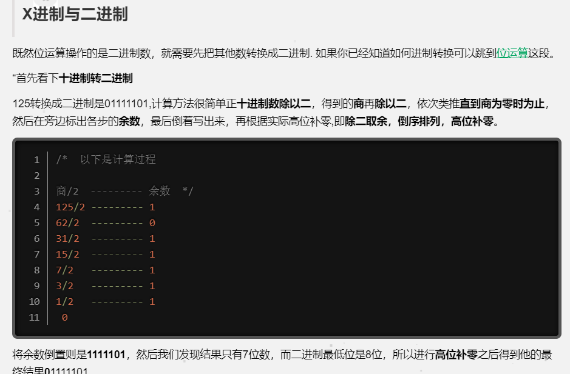

[toc]

### 位运算的基本操作符

下表显示了 C++ 支持的位运算符。假设变量 A 的值为 60，变量 B 的值为 13，则：

- **运算符 描述 实例**
  **& 如果同时存在于两个操作数中，二进制 AND 运算符复制一位到结果中。 (A & B) 将得到 12，即为 0000 1100**
  **| 如果存在于任一操作数中，二进制 OR 运算符复制一位到结果中。 (A | B) 将得到 61，即为 0011 1101**
  **^ 如果存在于其中一个操作数中但不同时存在于两个操作数中，二进制异或运算符复制一位到结果中。 (A ^ B) 将得到 49，即为 0011 0001**
  **~ 二进制补码运算符是一元运算符，具有"翻转"位效果，即 0 变成 1，1 变成 0。 (~A ) 将得到 -61，即为 1100 0011，一个有符号二进制数的补码形式**

- & 运算符 //and
- 两个位都为 1 取 1，否则取 0 
- | 运算符 // or
- 两个位都为 0 时，结果才为 0，否则取 1
- ~ 取反，就是把数都反过来

- &1 的意思可以理解为%2 判断偶数，与 1 取与后，
- ( **>>** ) 左移，表示整个 2 进制往后移动 1 位 相当于 int number/2
- **比如 >>2 == >>0011 = 0001;**

## 进制转换

- 十进制转二进制 原理如图
- 
- 代码实现

```C++ {.line-numbers}
 vector <int> ans;
    int n;
    cin>>n;
    while(n)//
    {
        ans.push_back(n&1),n>>=1;

    }
    reverse(ans.begin(),ans.end());
    for(i = 1;i<=ans.size();i++)
    cout<<ans[i];
```

### 有趣的 bitset

- 相当于生成一个二进制的字节空间
- `bitset<4> k` 这个生成的是一个四个字符的字节空间
- bitset 的一些有趣函数

```C++ {.line-numbers}
bitset<8> foo ("10011011");

    cout << foo.count() << endl;　　//5　　（count函数用来求bitset中1的位数，foo中共有５个１
    cout << foo.size() << endl;　　 //8　　（size函数用来求bitset的大小，一共有８位
    cout << foo.test(0) << endl;　　//true　　（test函数用来查下标处的元素是０还是１，并返回false或true，此处foo[0]为１，返回true
    cout << foo.test(2) << endl;　　//false　　（同理，foo[2]为０，返回false

    cout << foo.any() << endl;　　//true　　（any函数检查bitset中是否有１
    cout << foo.none() << endl;　　//false　　（none函数检查bitset中是否没有１
    cout << foo.all() << endl;　　//false　　（all函数检查bitset中是全部为１
```

- 小小例题 from acwing
- 求数组中数的二进制中 1 的个数

```C++ {.line-numbers}
    int T, n;
    for (cin >> T; T--;)
    {
        int ans = 0;
        cin >> n;
        bitset<16> t(n);
        cout << t.count() << " ";
    }
    一般做法
    int ans(int n)
    {
        int sum = 0;
        while(n)
        {
            if(n&1)
            sum++;
            n>>=1;
        }
        return sum;
    }
      5
  in  1 2 3 4 5
  out 1 1 2 1 2
```

### 常识

-     1bit = 8byte byte是最小的储存单位，表示字节。
-     1mb = 1024kb = 1024*1024bit = 1024*1024*8byte
-     256 mb = 67,108,864byte;

## 好 sword 的进制转换 (特性)

    int s;
    cin>>hex>>s;
    cout<<dec<<s;//转10进制
    cout<<oct<<s<<endl;//转八进制

### 统计 x 进制中的 1

```C++ {.line-numbers}
int prime(int n,int x)
{
    int sum = 0;
    while(n)
    {
        if(n%x==1)
            sum++;
        n/=x;
    }
 return sum;
}
```

### 快速幂

- 原理 根据 2 进制运算规则 以 11 为例 可以拆分成 2^3 + 2^ 1 如果我要 3^11 那其实就是 3^(8) \* 3^(2)
  2^3 2^1
  8 4 2 1
  1 0 1 1
- 本质上就是把次方数转换为 2 进制，然后再一个一个位的相乘，就不会爆。 大概能处理的范围是 10^18
- **代码实现，经典模板**

```C++ {.line-numbers}
ll fpow(ll a,ll b,ll p)
{
    ll sum = 0;
    while(b) // 本质上这个就是*的次数罢了
    {
        if(b&1)//判断如果当前的位数是偶数的话，比如2^3 就实现一次相乘
        {
            sum = (sum*a)%p
        }
        a = a*a%p;
        b>>=1;//相当于除2 得到位数
    }
    return sum%p;
}

```

- **那么同理，实现 a\*b 可以使用这个方法**

```C++ {.line-numbers}
    ll fpow(ll a,ll b,ll p)
{
    ll sum = 0;
    while(b) // 本质上这个就是*的次数罢了
    {
        if(b&1)//判断如果当前的位数是偶数的话，比如2^3 就实现一次相加
        {
            sum = (sum+a)%p
        }
        a = a*2%p;
        b>>=1;//相当于除2 得到位数
    }
    return sum%p;
}
```
