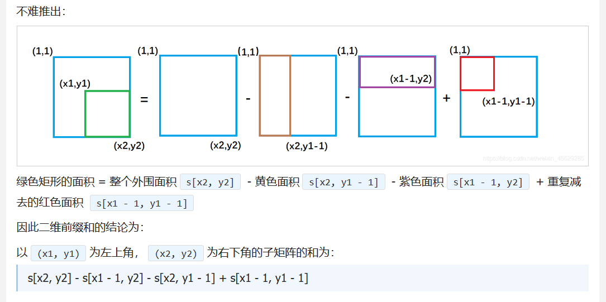

## 一维前缀和，区间

**公式**：$b[i] = b[i-1]+ a[i]$ 前提是先有一个 a 数组

- 前缀和就是先对数组进行一个预处理，将他前面的和先求出来，然后再根据题目，求解一些问题
- **模板**
  ```C++ {.line-numbers}
  b[0] = 0;
  for(int i = 1;i<=n;i++)
    {
        cin>>a[i];
        b[i] = b[i-1]+a[i];
    }
  ```
- 洛谷例题
- 啥勾八爱与恨的题，其实就是求最小值，不过用到了前缀和
- 那段比较核心骚的代码完美体现了前缀和,比如 a4 = a1+a2+a3 a4-a1 = a2+a3，刚好是前 m 个数的和,如 1 2 3 4 5 m = 3。

  ```C++ {.line-numbers}
    cin >> n >> m;
    if (n == 0)
    {
        cout << "0";
        return 0;
    }
    int i, j;
    int b[n + 5], c[n + 5];
    c[0] = 0;

    for (i = 1; i <= n; i++)
    {
        cin >> b[i];
        c[i] = c[i - 1] + b[i];
        if (i >= m)
            minn = min(minn, c[i] - c[i - m]);//这里把前缀和体现的淋漓尽致
    }
    cout << minn;

  ```

## 二维前缀和

预处理公式：
公式：$b[i][j] = b[i-1][j]+b[i][j-1]-b[i-1][j-1]+a[i][j]$

已知 x1,y1,x2,y2，求这个部分的前缀和公式
sum = s[x2,y2]-s[x1-1,y2]-s[x2,y1-1]+s[x1-1,y1-1];

- **模板**
  

```C++ {.line-numbers}
int n, m, q;
    int a[100][100], s[100][100];
    s[0][1] = 0, s[1][0] = 0, s[0][0] = 0;
    cin >> n >> m >> q;
    for (int i = 1; i <= n; i++)
    {
        for (int j = 1; j <= m; j++)
        {
            cin >> a[i][j];
            s[i][j] = s[i - 1][j] + s[i][j - 1] - s[i - 1][j - 1] + a[i][j];
        }
    }
    int x1, y1, x2, y2, sum;
    while (q--)
    {
        cin >> x1 >> y1 >> x2 >> y2;
        sum = s[x2][y2] - s[x1 - 1][y2] - s[x2][y1 - 1] + s[x1 - 1][y1 - 1];
        cout << sum << endl;
    }
    return 0;
```
