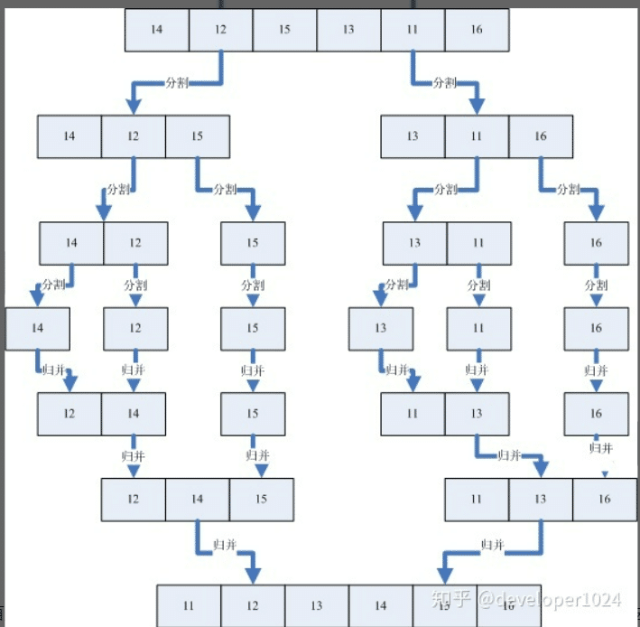

## 归并排序

- 归并排序采取了分治的思想，先分割成若干个子序列，然后再形成两个有序的子序列集合，最后再把这两个子序列合并在一起。

- **图片演示**



- 分解

## 快速排序

```C++ {.line-numbers}
void quicksort(int left,int right,vector<int> a)
{
    int key = a[left];
    while(left!=right)
    {
        while(key<a[right])
            right--;
        while(key>a[right])
            left++;
        swap(a[left],a[right]);
        key = left+right/2;
        swap(left,key);
    }

}
```
