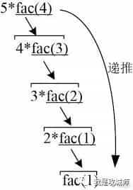
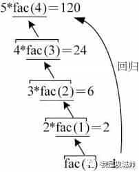

[toc]

# 递归思想

- **递归调用在底层其实是对线程栈的压栈和出栈操作，每调用一次都会压栈一次，并记录相关的局部变量信息**
- 递归的程序一般有两个步骤
  **一. 拆分问题，把问题拆解到不能再拆解，即一直调用到边界。然后把这些数据压入栈区**
  **二. 递推回归问题，就和进栈出栈一样，从栈顶开始，把数据一个一个的出栈计算**
  
  
- 线程栈的内存是非常有限的，而递归调用如果是无限的，那么很快就会消耗完所有的内存资源，最终导致内存溢出，这一点与空的 while 死循环是不一样的，单纯的死循环会大量的消耗 cpu 资源，但不会占用z存资源，所以不会导致程序异常。


## 基本的递推递归问题

- ### 经典的斐波那契数列

```C++ {.line-numbers}
int fib(int n)
{
    if (n == 1 || n == 2)
        return 1;
    else
    return fib(n - 1) + fib(n - 2);
}
f[500] = {0},i,j;
long long fib(int n)
{
    if(n==0||n==1)
    {
        f[n] = 1;
    }
    f[n]=f[n-1]+f[n-2];
    return f[n];
}
//判断是不是斐波那契数列
ll isf(int m)
{
   int f = 0;
   for (int i = 1; fib(i) <= m; i++)
   {
      if (fib(i) == m)
      {
         f = 1;break;
      }
   }
   return f;
}
```

## 卡特兰组合数

```C++ {.line-numbers}
#include <bits/stdc++.h>
using namespace std;
//卡特兰数最好公式 h[n] = c[2n][n]-c[2n][n-1];
//组合数公式 c[i][j] = c[i-1][j]+c[i-1][j-1];
long long c[10000][5000], i, j;
int main()
{
    int n;
    cin >> n;
    for (i = 1; i <= 2 * n; i++)
    {
        c[i][0] = c[i][i] = 1;
        for (j = 1; j < i; j++)
        {
            c[i][j] = c[i - 1][j] + c[i-1][j - 1];
            //先i-1的原因是，如果是i先的话，在i=1时，c11 = 2了
             // c(2,1) = c(1,0)+c(2,0);
        }
    }
    printf("%lld", c[2 * n][n] - c[2 * n][n - 1]);
}
```
