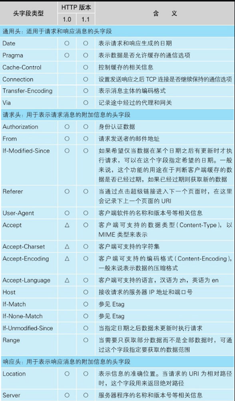
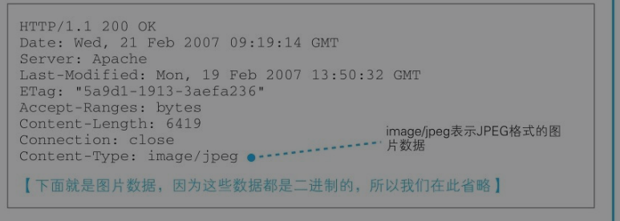

[toc]

# 第一章 浏览器生成消息——探索浏览器

## 对 url 的探索

详见 basic.md

## http 协议

### http 协议简介

- HTTP（HyperText Transfer Protocol，超文本传输协议）
- http 协议定义了客户端和服务器之间的传输数据的方法和步骤，其核心思路很简单，客户端发送请求——>通过 http 协议的方法——> 服务器 然后再返回响应信息
- 超文本：原先一个个单一的文本，通过超链接将其联系起来。由原先的单一的文本变成了可无限延伸、扩展的超级文本、立体文本 而我们熟知的 html 的全名就是超文本解析语言
- HTML、JS、CSS、图片、字体、音频、视频等等文件，都是通过 HTTP（超文本传输协议） 在服务器和浏览器之间传输
- 每一次前后端通信，前端需要主动向后端发出请求，后端接收到前端的请求后，可以给出响应
- HTTP 是一个" 请求-响应" 协议

### http 请求响应的过程

**浏览器通过 http 协议先向服务器发送请求 请求的内容包括 “对什么” 和 “进行怎样的操作” 两个部分。**

- 对什么其实就是访问目标即 URL
- 进行怎么样的操作称为方法。方法如下

### http 的主要方法

其实基本上用的也就 GET POST PUT DELETE 方法
这些都是浏览器发送请求时的主要方法和响应无关

- GET 方法
  **GET 方法其实相当于直接读取这个 url，直接获取 url 指定的数据**

- POST 方法
  POST 方法一般应用于表单 相当于我们创建了一些数据，然后再将这些信息发送给服务器，那**在传递的信息中除了 url 和请求信息外还需要加上这些我们输入的信息**。使用 POST 方法时，url 就会指向 web 服务器运行的一个应用程序的文件名 比如 index.php 这样的文件。然后服务器再从这个指定的应用程序中接受输出的结果再返回给客户端。

- PUT 更新数据
  应用场景：修改个人信息，修改密码

- DELETE 删除数据
  应用场景：删除一条评论

### 生成 http 请求消息

[这篇好诶](https://blog.csdn.net/heyue_99/article/details/74689057)

#### http 报文

- 浏览器向服务器发送请求时，请求本身就是信息，叫请求报文
- 服务器向浏览器发送响应时传输的信息，叫响应报文

#### http 请求报文

**注意，这里的消息一般叫报文，只是习惯了叫消息**

- 求报文格式：
  请求头：起始行 + 首部
  请求体
- **GET 请求：没有请求体，数据通过请求头携带**
- **POST 请求：有请求体，数据通过请求体携带**
- 响应报文格式：
  响应头：起始行 + 首部
  响应体
  

- **请求信息的第一行是请求行，一般通过这行可以了解请求的大致内容**
- **第二行开始为消息头**
  消息头的规格中定义了很多项目，如日期、客户端支持的数据类型、语言、压缩格式、客户端和服务器的软件名称和版本、数据有效期和最后更新时间等。
  
  

- **仅限 POST 方法** 最后部分是消息体是它将一个页面表单中用户输入的数据以`param1=value1&param2=value2 `的键值对形式编码成一个格式化串，放入消息体中，它承载多个请求参数的数据。

**完整的一个例子**
例:

- 请求行: POST/www.bilibili.com/user.html HTTP/1.1
- 消息头: <> User-Agent: Mozilla/4.0 ....
- 消息体: name=tom&password=1234&user=bbb

#### http 响应报文

**格式**

- 请求行：HTTP/1.1 (状态码)200 OK(状态)
- 请求头：Content-Type: text/html/image/charset=utf-8 =
  Content-length:10
  Content-encoding:zip
  空行
- 请求体：<html></html>

### 常用的请求头和响应头详解

- Content-Type("","")
  text/html ： HTML 格式
  text/plain ：纯文本格式
  text/xml ： XML 格式
  image/gif ：gif 图片格式
  image/jpeg ：jpg 图片格式
  image/png：png 图片格式
  以 application 开头的媒体格式类型：

application/xhtml+xml ：XHTML 格式
application/xml： XML 数据格式
application/atom+xml ：Atom XML 聚合格式
application/json： JSON 数据格式
application/pdf：pdf 格式
application/msword ： Word 文档格式
application/octet-stream ： 二进制流数据（如常见的文件下载）
application/x-www-form-urlencoded ： <form encType=””>中默认的 encType，form 表单数据被编码为 key/value 格式发送到服务器（表单默认的提交数据的格式）
另外一种常见的媒体格式是上传文件之时使用的：

multipart/form-data ： 需要在表单中进行文件上传时，就需要使用该格式
