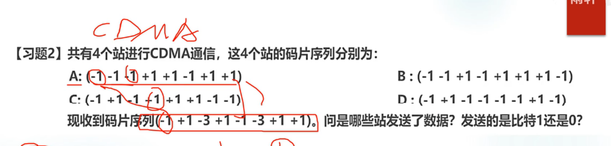
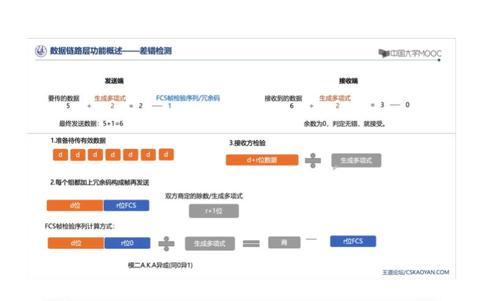
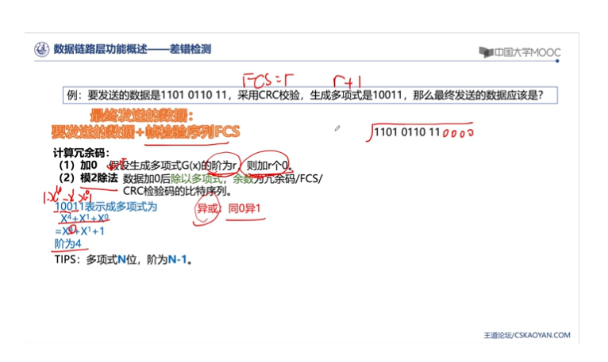
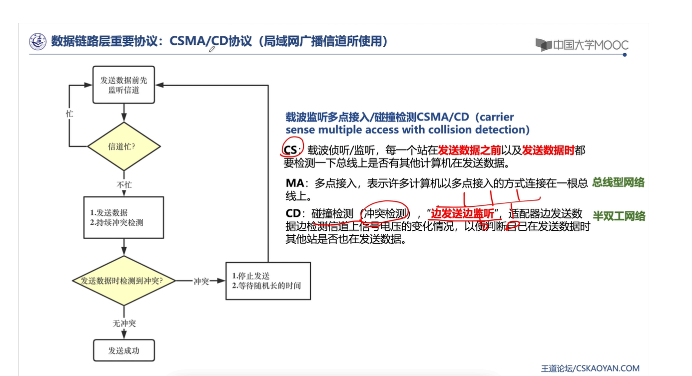
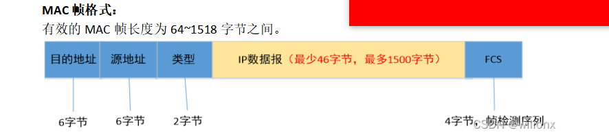
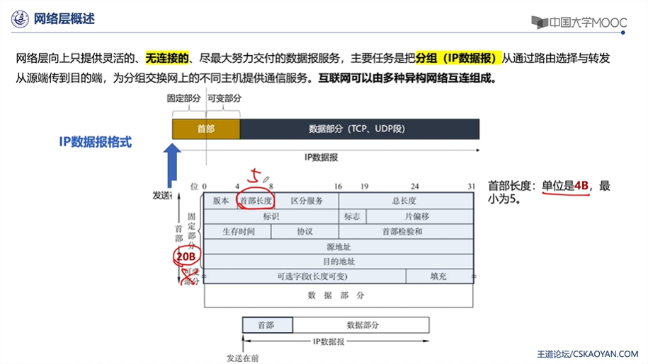
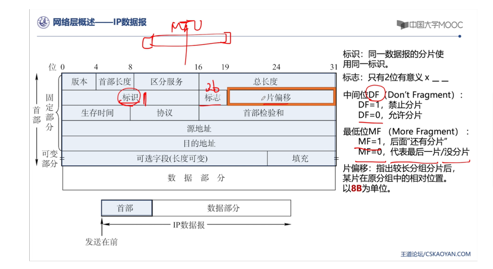

[toc]

## 第一章 计算机网络概述 10 分

### 1.1 计算机网络在信息时代中的作用

- 三网
  三网指的是电信网络(电话，电报传真)，有线电视网络(电视节目)，计算机网络(计算机之间传输数据)三大网络

### 1.2 互联网概述

- 计算机网络的定义
  计算机网络是由若干个结点，和连接这些结点的链路组成的网络。通过各种协议传输信息，**达到通信和资源共享的目的**。结点可以是计算机，路由器，交换机。
- 互联网（网络的网络）
  计算机网络和计算机网络之间又可以通过路由器连接起来，形成更加庞大的网络群，这就是互联网。比如说一个省的所有网络，就是一个庞大的互联网群
- 互联网按照网络的作用范围划分
  广域网 WAN:几十到几千公里
  城域网 MAN：覆盖城市范围 5-50km
  **局域网 LAN：一个单位的局域网 1km 左右**
  个人局域网 PAN： 10m 左右
- 计算机网络的发展过程
  第三阶段：形成了多层 ISP（互联网服务供应商）结果的互联网。ISP 可以申请到很多的 IP 地址，然后用户可以通过 isp 活动 ip 地址的使用权。

### 1.3 互联网的组成

- 组成
  边缘部分：由所有连接在互联网上的主机组成，这部分由用户直接使用，用来进行通信(传输数据，资料)和资源共享。
  核心部分：由大量网络和连接这些网络的路由器组成。为边缘部分提供服务，也就是提供联通性和交换。
  客户-服务器方式（c/s）方式，对等连接方式 p2p，p2p 中通信双方既是客户端，又是服务器。
  在网络核心部分起特殊作用的是路由器，路由器是一种特殊的计算机，他的作用就是用于在分组交换中，转发收到的分组，相当于是一个中转站。
- 客户-服务器通信方式
  客户是服务的请求方，服务器是服务的提供放，他们都要使用网络核心提供的服务。

- **分组交换、电路交换、报文交换**
  互联网核心部分采用了分组交换技术，电路交换--整个报文的比特流从源点直达重点，好像在一个管道中传输。
  报文交换，报文会先传送到相邻节点，全部储存后查找转发表，转发
  分组交换，单个分组传送到相邻节点，储存下来后查找转发表，转发到下一个节点。

- 分组交换
  分组交换采用的是储存转发技术，就是，你客户端发送了一个报文，其实就是 url，然后他会先把这个报文（二进制）拆分成几个分组，然后每个数据段都加个首部，也就是 headers。

### 网络分层结构。

OSI/RM 体系结构分为七层。
自顶向下分别是

- 应用层，表示层，会话层，运输层，网络层，数据链路层，物理层。

- TCP/IP 的体系结构
  应用层(DNS,HTTP,SMTP)，运输层(TCP、UDP),网络层(IP) 链路层

- 我们现在的分成
  应用层，运输层，网络层，数据链路层，物理层。

## 物理层

### 物理层的基本概念

- 物理层的意义是为了保证，链路层传输信息尽可能的不受到物理层面的影响，尽可能的屏蔽掉传输媒体和通讯手段的差异。
- 物理层的主要任务就是确定与传输媒体(其实就是电线，网线，同轴电缆那些东西)的接口有关的一些特性。
  人话来说就是，物理层要确定这些线路啊之间的传输协议。然后物理层的主要任务就是，在各种计算机的传输媒体上传输比特流，确定与传输媒体有关的一些特性。
- 特性：
  机械特性
  电气特性
  功能特性
  过程特性

### 通信基础知识

数据通信分为 3 大部分
源系统(发送端)，比如我们的电脑
传输系统(传输网络)
目的系统(接收端，接受方)

信道：单工，半双工，全双工

香农公式：$ x = Wlog2(1+S/N)$

#### 计算题 cdma 码分多址
- **采用正交法**
  
  
  

- 常用带通调制方式
  调幅，调频，调项，正交振幅调制。

## 链路层

### 链路层的基本功能

将网络层传入的 ip 数据报封装成帧(通过协议加上帧首部和帧尾部)，再传给物理层转换成比特流，再在传输媒体上传输，解封装，最后到目标设备。
链路层的信道类型
一对一：点对点信道 isp
一对多：广播信道

### 链路层的功能描述 (链路层要解决什么问题)

#### 封装成帧

对 ip 数据报加上首部和尾部
首部 SOH
尾部 EOH
首部和尾部的作用是进行**帧定界**（即确定帧的界限）
每一种链路层协议都规定了所能传送的帧的数据部分长度上限——最大传输单元MTU
帧开始符SOH：十六进制编码为01（00000001）2
帧结束符EOT：十六进制编码为04（00000100）2
#### 透明传输

如果在数据段中，出现了和首部或者尾部字段相同的字段时，接受方会错误识别，而这个时候就是要在其中添加转移字符来解决

#### 差错检测

- **CRC** 计算题
 
  
### 链路层中的协议

#### ppp 协议

用于点对点信道，即全双关信道时才使用。
目前使用最广泛的数据链路层协议，用户使用拨号电话接入因特网时一般都使用 ppp 协议(用户计算机和 isp 进行通信时所使用的协议)

透明传输是通过 ppp 协议来实现的，主要有两个方法

- 定义，用户和 ISP 进行通信时所使用的数据链路层协议。

- **异步传输**，面向字符,每次传输的是一个字节:**字节填充法**，添加转义字符 **ESC**
  这里是异步的原因是你不知道用户什么时候会在键盘上输入字符。
- **同步传输**，面向比特，每次传输的是一个帧：**零比特填充法**（每 5 个 1 就填充一个 0）
  例：标志字段 F 是 011111110，利用零比特填充法添加零后变成，0111110110。放到物理层上进行传输，接受方发现了有连续的 5 个 1 后，后面有个 0，就会去掉这个 0

#### CSMA/CD 协议 (局域网广播信道所使用)
- CSMA全称，载波监听多址接入碰撞检测协议。
  IEEE 802.11 无线局域网所用协议
- **工作原理:
  在每次发送信息前首先监听信道看有没有其他的计算机在发送数据，如果信道忙就持续监听，直到信道空闲发送数据，然后持续进行冲突检测，如果遇到冲突，就停止发送数据，然后等待随机长的时间，如果没遇到冲突，发送成功。**
  

- CSMA 协议用于动态的分配信道
  信道并非在用户通信时固定分配给用户，而是用户使用时，征用带宽分配给用户

- CS 载波侦听/监听，每次发送数据前，都要检测在这条信道上是否有别的计算机在
- MA 多点接入(多址接入)
- CD 碰撞检测(冲突检测)，如果检测到碰撞就会停止发送数据

### 局域网
按传输介质分
- 有线局域网
常用介质：双绞线，同轴电缆，光纤
T：双绞线
    在数据链路层扩展以太网要使用网桥。网桥工作在数据链路层，根据MAC帧的目的地址对收到的帧进行转发和过滤。网桥根据转发表来转发帧，转发表也称为转发数据库或路由目录。
- 无线局域网
IEE802.11
常用介质：红外，微波

**IEE802.3**

#### MAC子层
- MAC子层主要的

### 以太网
- 计算机靠适配器连接到网络(网络接口卡/网卡)

#### MAC地址/MAC帧
MAC :介质访问控制子层
MAC地址
每个适配器都有全球唯一的48位2进制地址(6位16进制)，前24(3)位代表厂家，后24(3)位厂家自己知道，常用6个16进制数表示 如 02-60-8c-e4-b1-21
- MAC帧
包含单播帧，广播帧，多播帧。

.

### 链路层设备
- 功能：拓展以太网
- **网桥**
- 透明网桥

- 交换机 = 多接口网桥，应用在虚拟局域网VLAN

## 网络层

网络层重点考查和 ip 地址有关的计算。

### 网络层概述

网络层向上只提供灵活的，无连接的

主要是把分组(ip数据报)从通过路由选择与转发从源端传到目的端

### IP地址

#### IP 数据报格式
首部+数据部分

首部长度：单位是4b，最小为5
总长度：首部+数据，单位是1b
标识：同一数据报的分片使用同一标识
标志占3位，只有2位有意义
中间位DF(Dont Fragment)
DF = 1,禁止分片
DF = 0，
- **首部检验和**
  
#### IP分片