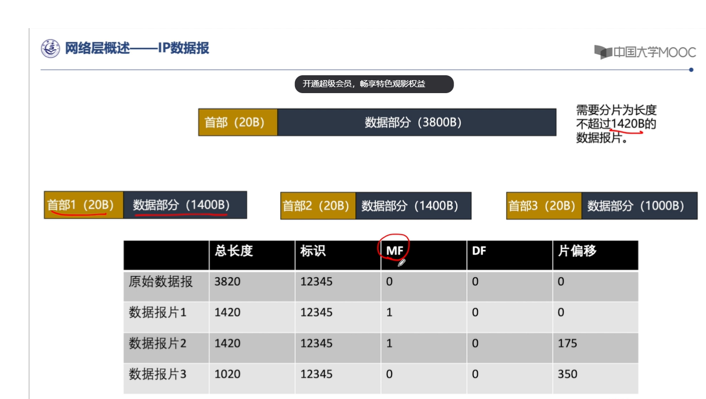
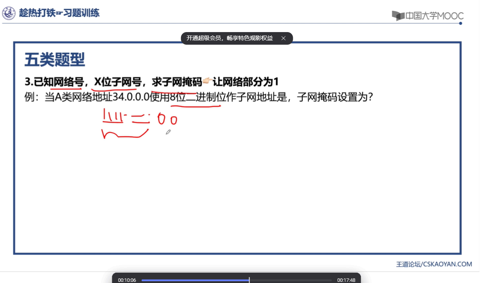
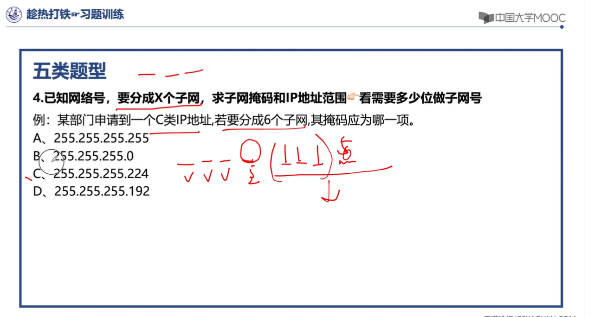

[toc]

## 第一章 计算机网络概述 10 分

### 1.1 计算机网络在信息时代中的作用

- 三网
  三网指的是电信网络(电话，电报传真)，有线电视网络(电视节目)，计算机网络(计算机之间传输数据)三大网络

### 1.2 互联网概述

- 计算机网络的定义
  计算机网络是由若干个结点，和连接这些结点的链路组成的网络。通过各种协议传输信息，**达到通信和资源共享的目的**。结点可以是计算机，路由器，交换机。
- 互联网（网络的网络）
  计算机网络和计算机网络之间又可以通过路由器连接起来，形成更加庞大的网络群，这就是互联网。比如说一个省的所有网络，就是一个庞大的互联网群
- 互联网按照网络的作用范围划分
  广域网 WAN:几十到几千公里
  城域网 MAN：覆盖城市范围 5-50km
  **局域网 LAN：一个单位的局域网 1km 左右**
  个人局域网 PAN： 10m 左右
- 计算机网络的发展过程
  第三阶段：形成了多层 ISP（互联网服务供应商）结果的互联网。ISP 可以申请到很多的 IP 地址，然后用户可以通过 isp 活动 ip 地址的使用权。

### 1.3 互联网的组成

- 组成
  边缘部分：由所有连接在互联网上的主机组成，这部分由用户直接使用，用来进行通信(传输数据，资料)和资源共享。
  核心部分：由大量网络和连接这些网络的路由器组成。为边缘部分提供服务，也就是提供联通性和交换。
  客户-服务器方式（c/s）方式，对等连接方式 p2p，p2p 中通信双方既是客户端，又是服务器。
  在网络核心部分起特殊作用的是路由器，路由器是一种特殊的计算机，他的作用就是用于在分组交换中，转发收到的分组，相当于是一个中转站。
- 客户-服务器通信方式
  客户是服务的请求方，服务器是服务的提供放，他们都要使用网络核心提供的服务。

- **分组交换、电路交换、报文交换**
  互联网核心部分采用了分组交换技术，电路交换--整个报文的比特流从源点直达重点，好像在一个管道中传输。
  报文交换，报文会先传送到相邻节点，全部储存后查找转发表，转发
  分组交换，单个分组传送到相邻节点，储存下来后查找转发表，转发到下一个节点。

- 分组交换
  分组交换采用的是储存转发技术，就是，你客户端发送了一个报文，其实就是 url，然后他会先把这个报文（二进制）拆分成几个分组，然后每个数据段都加个首部，也就是 headers。

### 网络分层结构。

OSI/RM 体系结构分为七层。
自顶向下分别是

- 应用层，表示层，会话层，运输层，网络层，数据链路层，物理层。

- TCP/IP 的体系结构
  应用层(DNS,HTTP,SMTP)，运输层(TCP、UDP),网络层(IP) 链路层

- 我们现在的分成
  应用层，运输层，网络层，数据链路层，物理层。

## 物理层

### 物理层的基本概念

- 物理层的意义是为了保证，链路层传输信息尽可能的不受到物理层面的影响，尽可能的屏蔽掉传输媒体和通讯手段的差异。
- 物理层的主要任务就是确定与传输媒体(其实就是电线，网线，同轴电缆那些东西)的接口有关的一些特性。
  人话来说就是，物理层要确定这些线路啊之间的传输协议。然后物理层的主要任务就是，在各种计算机的传输媒体上传输比特流，确定与传输媒体有关的一些特性。
- 四大特性：
  机械特性
  电气特性
  功能特性
  过程特性

### 通信基础知识

数据通信分为 3 大部分
源系统(发送端)，比如我们的电脑
传输系统(传输网络)
目的系统(接收端，接受方)

信道：单工，半双工，全双工

香农公式：$ x = Wlog2(1+S/N)$

#### 计算题 cdma 码分多址

- **采用正交法**
  
  
  

- 常用带通调制方式
  调幅，调频，调项，正交振幅调制。

## 链路层

### 链路层的基本功能

将网络层传入的 ip 数据报封装成帧(通过协议加上帧首部和帧尾部)，再传给物理层转换成比特流，再在传输媒体上传输，解封装，最后到目标设备。
链路层的信道类型
一对一：点对点信道 isp
一对多：广播信道

### 链路层的功能描述 (链路层要解决什么问题)

#### 封装成帧

对 ip 数据报加上首部和尾部
首部 SOH
尾部 EOH
首部和尾部的作用是进行**帧定界**（即确定帧的界限）
每一种链路层协议都规定了所能传送的帧的数据部分长度上限——最大传输单元**MTU 以太网和 802.3 对数据帧的长度都有一个限制，其最大值分别是 1500 字节和 1492 字节。链路层的这个特性称为 MTU，即最大传输单元。不同类型网络的数帧长度大多数都有一个上限。**
帧开始符 SOH：十六进制编码为 01（00000001）2
帧结束符 EOT：十六进制编码为 04（00000100）2

#### 透明传输

如果在数据段中，出现了和首部或者尾部字段相同的字段时，接受方会错误识别，而这个时候就是要在其中添加转移字符来解决

如图所示，在数据段中出现了 SOH 或 EOT 为了不识别错误，错误的划分开头和结尾，就在每个相同字段前进行 **字节填充** **添加转义字符 ESC（十六进制编码为 1B）** 然后再送往链路层的过程中会删除转义字符

#### 差错检测

- **CRC** 计算题
  
  

### 链路层中的协议

#### ppp 协议

ppp 协议包含物理层和网络层的内容
用于点对点信道，即全双关信道时才使用。
目前使用最广泛的数据链路层协议，用户使用拨号电话接入因特网时一般都使用 ppp 协议(用户计算机和 isp 进行通信时所使用的协议)

- ppp 协议定义，用户和 ISP 进行通信时所使用的数据链路层协议。
- ppp 帧的格式
  

**透明传输是通过 ppp 协议来实现的，主要有两个方法**

- **异步传输**，面向字符,每次传输的是一个字节:**字节填充法**，添加转义字符 **ESC** to 网络
  这里是异步的原因是你不知道用户什么时候会在键盘上输入字符。
- **同步传输**，面向比特，每次传输的是一个帧：**零比特填充法**（每 5 个 1 就填充一个 0） to 物理
  例：标志字段 F 是 011111110，利用零比特填充法添加零后变成，0111110110。放到物理层上进行传输，接受方发现了有连续的 5 个 1 后，后面有个 0，就会去掉这个 0

#### CSMA/CD 协议 (局域网广播信道所使用)

- CSMA 全称，载波监听多址接入碰撞检测协议。
  IEEE 802.11 无线局域网所用协议
- **工作原理:
  在每次发送信息前首先监听信道看有没有其他的计算机在发送数据，如果信道忙就持续监听，直到信道空闲发送数据，然后持续进行冲突检测，如果遇到冲突，就停止发送数据，然后等待随机长的时间，如果没遇到冲突，发送成功。**
  

- CSMA 协议用于动态的分配信道
  信道并非在用户通信时固定分配给用户，而是用户使用时，征用带宽分配给用户

- CS 载波侦听/监听，每次发送数据前，都要检测在这条信道上是否有别的计算机在
- MA 多点接入(多址接入)
- CD 碰撞检测(冲突检测)，如果检测到碰撞就会停止发送数据

### 局域网

按传输介质分

- 有线局域网
  常用介质：双绞线，同轴电缆，光纤
  T：双绞线
  在数据链路层扩展以太网要使用网桥。网桥工作在数据链路层，根据 MAC 帧的目的地址对收到的帧进行转发和过滤。网桥根据转发表来转发帧，转发表也称为转发数据库或路由目录。
- 无线局域网
  IEE802.11
  常用介质：红外，微波

**IEE802.3**

#### MAC 子层

- MAC 地址是每个电脑特有的自带的物理地址
- MAC 子层主要的

### 以太网

- 计算机靠适配器连接到网络(网络接口卡/网卡)

#### MAC 地址/MAC 帧

MAC :介质访问控制子层
MAC 地址
每个适配器都有全球唯一的 48 位 2 进制地址(6 位 16 进制)，前 24(3)位代表厂家，后 24(3)位厂家自己知道，常用 6 个 16 进制数表示 如 02-60-8c-e4-b1-21

- MAC 帧
  包含单播帧，广播帧，多播帧。
  
  .

### 链路层设备

- 功能：拓展以太网
- **网桥**
- 透明网桥

- 交换机 = 多接口网桥，应用在虚拟局域网 VLAN

## 网络层

网络层重点考查和 ip 地址有关的计算。

### 网络层概述

网络层向上只提供灵活的，无连接的
主要是把分组(ip 数据报)从通过路由选择与转发从源端传到目的端，为分组交换网上的不同主机提供通信服务，互联网可以有多种异构网络互连而成

### IP 地址

IP 地址就是给连接到互联网上的每一台主机（路由器）的每一个接口，分配一个在全世界范围内是唯一的 32 位的标识符。
IPv4：32 位

#### IP 数据报格式

首部+数据部分

首部长度：单位是 4b，首部是固定的 20 字节
总长度：首部+数据，单位是 1b
标识：同一数据报的分片使用同一标识
标志占 3 位，只有 2 位有意义
中间位 DF(Dont Fragment)
DF = 1,禁止分片
DF = 0，允许分片
最低位 MF
MF = 1 后面还有分片
MF = 0 代表最后一片没有分片

**首部检验和**：只检验首部
源地址和目的地址：32 位
#### IP首部检验和(计算)

#### IP 分片(计算)

**片偏移：指的是较长分组分片之后，某片在原分组中的相对位置，以 8B 为单位**
**计算方法**：除 8
以图为例

因为分片长度最多不能超过 1420b，所以数据报在 1400 长度的时候就要分片，不用管首部，因为首部是数据部分分片出去以后加上的 20b

原始数据报当然没有分片和数据报什么的

然后数据报 1 MF 为 1 表示后面还有分片

**数据报 2 在第一个分片后，他的前面还有 1400 字节，他是从 1400 开始的，所以就是$1400/8 = 175 $**

**数据报 3 同理 在第二个分片后 那么他前面就要 2800 字节，所以他的片偏移就是 $ 2800/8 = 350$**

#### 分类的 IP 地址

IP 地址由网络号和主机号组成
IP 地址总共有 5 类

**在 IP 地址 3 种主要类型里，各保留了 3 个区域作为私有区域，其地址范围如下:**
A 类:10.0.0.0 ～ 10.255.255.255
B 类:172.16.0.0 ～ 173.31.255.255
C 类:192.168.0.0 ～ 192.168.255.255

**ip 地址是以点分 10 进制来转换的**
A 类 ip 地址 的第一位的二进制数一定是从 0 开始的，也就是说他的二进制编码一定是 0xxx.开头的，以最小的 A 类 ip 地址为例 $0000001.0000.0000.0000 = 1.0.0.0$ 他的最大可用网络数为
B 类 就是以 10xxx 开头的 也就是说最小的都是 1100.0000.0000.0000 也就是 128.0.0.0
C 类同理，以 110x 开头

- 一些特殊的 ip 地址
  

#### 子网掩码与子网划分

子网掩码就是把 ip 地址的网络位全部转换成 2 进制的 1，然后主机位转换成 0
子网就是说，一个主机地址可以划分出很多个小的子网，比如说校园网，划分教学楼区域这样

已知 ip 地址和子网掩码，我们可以求出网络地址
**常见的题型**

- 解法，例题 1 是经典的，将子网地址与 ip 地址相与即可
  
- 这题的解法是，看子网掩码后面剩多少位，先转化为 2 进制，前面是 24 位加上 240 的 4 个 1，也就是，28 位，剩下的 4 位用来作主机号，那么 4 位做主机号的话，我们最多可以划分$2^2$个子网，6 位可以划分 8 个，那主机就-2
  
- 这题就是你看是什么网络，a 类网络的网络号为 8 位，然后他又用 8 位来做子网地址，所以，他的子网掩码就设置为，255.255.0.0
  
- 思路和前面同理，划分子网，首先看着是 c 类地址，那么，24 位作为网络号，那后面只有 8 位能做主机位，然后他有说起码 6 个子网，那起码得有 3 位用来作子网，那就是 111 224 选 c
  
- 这个就一个个将地址与选项相与，有技巧的，看 255 的和谁相与谁就不变，再排除排除就 OK

#### 几大重要协议

- ICMP
  
  
  icmp 协议简单来说就是，如果遇到找不到目标主机的情况，用来发送差错报文的。ICMP 只能搭配 IPv4 使用。
  确认 IP 包是否成功到达目标地址
  通知在发送过程中 IP 包被丢弃的原因

- ARP
  
  ARP 协议：完成主机路由器 IP 地址到 MAC 地址的映射，解决下一跳走哪的问题。
  地址解析协议，即 ARP（Address Resolution Protocol），是根**据 IP 地址获取物理地址的一个 TCP/IP 协议**。主机发送信息时将包含目标 IP 地址的 **ARP 请求广播**（采取广播方式）到局域网络上的所有主机，并接收返回消息，以此确定目标的物理地址；收到返回消息后将该 IP 地址和物理地址存入本机 ARP 缓存中并保留一定时间，下次请求时直接查询 ARP 缓存以节约资源。地址解析协议是建立在网络中各个主机互相信任的基础上的，局域网络上的主机可以自主发送 ARP 应答消息，其他主机收到应答报文时不会检测该报文的真实性就会将其记入本机 ARP 缓存；
  最直白的说法是：**在 IP 以太网中，当一个上层协议要发包时，有了该节点的 IP 地址，ARP 就能提供该节点的 MAC 地址。**
- IGMP(组播)
  

- **路由选择协议**
  
- 内部网关协议
  RIP，OSPF
- 外部网关协议

## 传输层

### 报文、报文段、分组、包、数据报、帧、数据流的概念区别

- **其实这些东西本质来说都是一个东西，只是他在每个层中的含义不同，传输方式不同，会经过每一个层的特殊处理（加上首部），举个简单的例子，就好像是你买了一个东西，通过邮局寄送，在传输过程中，会被加上特殊的包装，而这个特殊的包装就是帧，而里面的内容就是报文。**

- 报文
  报文就是在我们熟悉的应用层中，通过 http 协议传输的一组请求数据，或者是 response，内容嘛，就是头加报文体，利用有一堆什么时间啊，传输所用协议，然后带上 url 什么的。
  报文包含了将要发送的完整的数据信息，其长短不需一致。报文在传输过程中会不断地封装成分组、包、帧来传输，封装的方式就是添加一些控制信息组成的首部，那些就
- 报文段
  报文段是在运输层传播的，tcp/udp 报文段
- 分组，包
  分组和包就是在网络层传播的
- 帧
  链路层传播的是帧
- bit
  物理层传输的是 bit

### 传输层的基本概念

- 传输层是在网络层之上的，在进程，也就是应用程序之间进行传输。传输层传输的是报文段。
- 传输层的作用是给他上层的应用层，提供通信服务

- **传输层的两个很重要的功能 —— 分用，复用**
  - 复用：**多个应用程序，公用同一个传输层**
  - 分用：**在接受端，传输层根据端口号，将数据分配给不同的应用程序**
- 传输层会对传输的报文进行差错检测，是整个报文段，而网络层只对首部进行差错检测

### TCP 协议

#### TCP 协议的特点

1. TCP 是**面向连接的**
   也就是说，TCP 协议要求传送方和接受方必须先建立连接，才能传输数据，传完了以后还得断开
   **通信前需要建立连接，通信结束需要释放连接**。
   每一条 TCP 连接只能有两个端点 p to p 的
2. **TCP 只能提供点到点的通信**，而 UDP 可以任意方式的通信。
   TCP 提供可靠交付的服务
   可靠指的是：TCP 发送的**数据无重复、无丢失、无错误、与发送端顺序一致。**
3. TCP **提供全双工通信**
   全双工通信指的是：TCP 的两端既可以作为发送端，也可以作为接收端。
   发送缓存，也能接收缓存。
   缓存(准备到达，或不按序到达，或者已经到达了还没有释放的数据)
4. TCP 是面向字节流的
   面向字节流指的是：TCP 以字节为单位。虽然传输的过程中数据被划分成一个个数据报 ，但这只是为了方便传输，接收端最终接受到的数据将与发送端的数据一模一样。

#### TCP 连接的方式

- TCP 的连接端口叫套接字 socket
- 套接字 socket =（IP 地址:端口号）。
  因此，TCP 连接 ::=（套接字 1，套接字 2）={(IP1:端口号 1)，(IP2:端口号 2)}

#### TCP 协议的首部格式

TCP 首部和 IP 的差不多，tcp 数据部分其实就是 ip 数据报的数据部分。

- 源端口和目的端口
  源端口和目的端口就是发送双方两个进程
- 数据偏移
  数据偏移表示的是 TCP 报文段的数据部分距离距离报文段起始部分的距离，以 4B 为单位，其实就是 TCP 首部啦
- **序号 seq：本报文段所发送的数据的第一个字节序号**
  tcp 协议会把发送的报文段的字节流中的每一个字节，都编号，然后序号就是发送数据的第一个字节的编号
- **确认号 ack：期望收到对方下一个报文段的第一个数据字节的序号**
  那确认号就是，比如说我第一个报文段，发送了 1024 个 bit，那么我确认号，表示我下个想收到的，也就是说从 1025 开始的字节编号
- **确认位 ACK：仅当 ACK=1 时确认号字段才有效**
- **同步位 SYN：在连接建立时用来同步序号，SYN=1 表示这是一个连接请求或是连接接受请求。**
- **终止位 FIN：用来释放一个连接。当 FIN=1 时，表示此报文段的发送方数据已经发送完毕，并要求释放运输连接**

#### TCP 协议的 3 次握手

其实三次握手很好理解

- Step 1. 首先，第一次的时候，客户端向服务器发送请求报文段，这个时候，SYN = 1，表示诶我要和你连接了，然后发送一个 seq 确认号，比如我发送了一个 seq = x 的确认号。这时候发送没有应用层数据
- Step 2 然后服务器收到以后，OK 我同意你的连接申请，然后我发送 SYN = 1，然后我再这边再发送我第一次回应的序号 seq = y，然后我也要发 ACK = 1，然后我的 ack，我期望你下一部分的报文段编号从 ack = x+1 开始
- Step 3 然后第三次，客户端收到了服务器收到了的请求，然后发送 ACK = 1，ack = y+1，seq = x+1
  完成了这三步以后开始传输应用层数据

- **为什么客户端还需要再发送一次确认？**
  主要是为了防止已经失效的连接请求报文段突然又传到了 B，因而产生错误。“已失效的连接请求报文段”的产生在这样一种情况下：A 发出的第一个连接请求报文段并没有丢失，而是在某个网络结点长时间的滞留了（因为网络并发量很大在某结点被阻塞了），以致延误到连接释放以后的某个时间才到达 B。但是 B 收到此失效的报文段后，就认为是 A 又发出一次新的连接请求。于是就向 A 发出确认报文段，同意建立连接。如果不采用三次握手，那么只要 B 发出确认，新的连接就建立了，B 的许多资源就白白浪费。
- SYN Flood 攻击
  SYN Flood 攻击指利用 tcp 协议缺陷发送大量伪造的 TCP 连接请求，从而使被攻击方资源耗尽（CPU 满负载或者内存不足）的攻击法方式。解决方法：

缩短 SYN Timeout 时间缩短从接收到 SYN 报文到确定这个报文无效并丢弃该连接的时间，但是过低的 SYN Timeout 可能会影响用户正常访问。
设置 SYN Cookie 给每一个请求连接的 IP 地址分配一个 Cookie，如果短时间内连续受到某个 IP 的重复 SYN 报文，就认定是受到了攻击，以后从这个 IP 地址来的包会被丢弃
使用硬件防火墙

#### TCP 协议的四次挥手

- Step 1. 首先，客户端先发送停止连接的请求，然后 FIN = 1。
- Step 2. 然后服务器发送一个确认报文段，表示，ok 我收到了，我知道要断开连接了，那客户端到服务器的这个方向的连接就断开了。半关闭状态
  ACK = 1，seq = v，ack = u+1
- Step 3. 然后，服务器端发送完数据，就发憷连接释放报文段，表示，这次真的要断开了，然后主动关闭 TCP 连接
- Step 4. 最后客户端发送一个确认报文段，等到时间等待计时器里面设置的 2MSl（最长报文段寿命）后，连接彻底关闭

#### 拥塞控制，流量控制

### UDP 协议

#### UDP 的功能概述

- **UDP 只在 IP 数据报服务的基础上增加了少量的功能：复用与分用、对整个报文的差错检测。**
- **UDP 是无连接的**
  通信前不需要建立连接，通信结束也无需释放连接。
- **UDP 是不可靠的**
  它是尽最大努力交付，不能确保每一个数据报都送达。
- **UDP 是面向报文的**
  所谓 面向报文 就是指：UDP 数据传输的单位是报文，且不会对数据作任何 拆分 和 拼接 操作。
  在发送端，应用程序给传输层的 UDP 什么样的数据，UDP 不会对数据进行切分，只增加一个 UDP 头并交给网络层。
  在接收端，UDP 收到网络层的数据报后，去除 IP 数据报头部后遍交给应用层，不会作任何拼接操作。
- **UDP 没有拥塞控制**
  UDP 始终以恒定的速率发送数据，并不会根据网络拥塞情况对发送速率作调整。这种方式有利有弊。
  弊端：网络拥塞时有些报文可能会丢失，因此 UDP 不可靠。
  优点：有些使用场景允许报文丢失，如：直播、语音通话，但对实时性要求很高，此时 UDP 还是很有用武之地的。
- **UDP 支持一对一、一对多、多对多、多对一通信**
  而 TCP 只支持一对一通信。
  UDP 首部开销小，只有 8 字节。
  而 TCP 头部至少由 20 字节，相比于 TCP 要高效很多。
