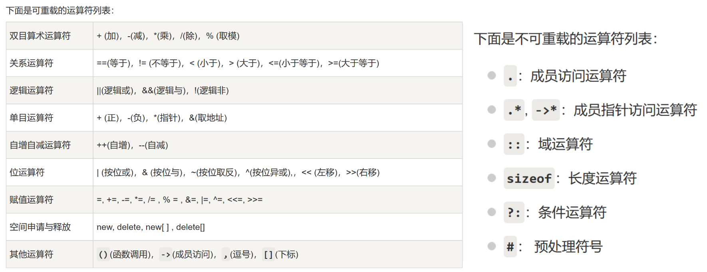

[toc]

## 基本知识

```C++ {.line-numbers}
c++类
面向对象的四个基本概念
对象 类 消息 方法 （函数，算法）
  三大特性
  对象
  封装 继承 多态 学完这三兄弟，然后再，把stl容器，函数预习一遍，文件操作，然后再搞项目
Class person
{
	1.属性
	2.行为
}
```

### 如何利用动态内存分配数组

- `int* a = new int [n];//`这里其实是用一个指针，指向一个新的数组
- **动态声明三维数组的方法**

```C++ {.line-numbers}
 float(*fp)[25][10];
    fp = new float[10][25][10];
    cout<<fp;
```

### 基本模板

- 关于 protected 成员，在继承类的类函数里面，是可以访问的，而在类外，也就是主函数里，是不可访问的。例如

```C++ {.line-numbers}
class bb{
    protected:
    int k;
};
class cc:public bb
{
    public:
    void set()
    {
        k = 1;//可行
    }
};
int main()
{
    bb.b;
    cout<<b.k;//不行，因为不在类内不能访问
}
```

```C++ {.line-numbers}
class box()//对象名
{
public:
    int a;
    int b;
    int c;
    private:// 类内可以访问，类外不可以

    protected:// 类内可以访问，类外不可以，子类可以访问
}
```

### 对于引用&的理解

- [忘了看这里](https://www.bilibili.com/video/BV1et411b73Z?p=91);

#### 本质

- &的本质就是为变量更改别名，比如。。。。在这个例子里面，a 在内存区开辟了 4 个字节的空间存放数据，而&是取地址，&a 取了 a 的地址，赋值给 b，相当于 b 就指向了这个内存空间，对于 b 进行修改就是对 a 进行修改。

```C++ {.line-numbers}
int a = 10;
int b = &a;
b = 20;
cout<<a;//a为20
```

#### 引用变量作为函数参数的用法和实际意义

##### 引用变量作为函数的参数

- 以经典的 void 为例
- 在例 1 里
  结果是 1,2 实参并没有发生改变，因为在 void 里面，我们改变的是形参，而我们在 main 函数里面定义的 a 和 b 都没有发生实质的改变

```C++ {.line-numbers}
void swap1(int a,int b)
{
    int temp = 0;
    temp = a, a = b, b = temp;
}
int main()
{
    int a = 1, b = 2;
    swap1(a, b);
    cout<<a<<" "<<b<<endl;
    a = 1,b = 2
}
```

- **而在这个例子中，因为我们传入的 a，是&a，相当于直接指向了 a 的地址，相当于给 a 取了别名，那么我们在函数里面更改的，就是实参，也就是直接改变了原本 a 和 b 的值。**

```C++ {.line-numbers}
void swap(int &a, int &b)
{
    int temp = 0;
    temp = a, a = b, b = temp;
}
int main()
{
    int a = 1, b = 2;
    swap(a, b);
    cout<<a<<" "<<b<<endl;
    a = 2,b = 1;//发生了交换
}
```

##### 引用变量作为左值

```C++ {.line-numbers}
int& blue()
{
    static int a = 10;
    return a;
}
int main()
{
    blue() = 100;
    int &f = blue();
    cout<<f<<endl;
}
```

## 类函数

### 关于函数重载

一. 什么是函数重载

- 函数重载，简单来理解就是你写一个名字的函数，然后根据里面参数的不同，你可以不用重新命名，只需要再以这个函数名写一个函数，调整一下参数就可以用在不同的地方了。 -函数重载，允许函数名重复，但是参数数量不同----人话来说就是一个函数名定义多个函数
- 函数重载条件
  - 1.同一个作用下
  - 2.函数名相同
  - 3.函数参数类型不同，或者参数个数或顺序不一样。 函数返回值不可以作为函数重载的条件
- 例 在这里我用了同样的函数名来执行，不过函数的参数类型不同。

```C++ {.line-numbers}
int kk(int a,int b)
{
    return a+b;
}
double kk(double a,double b)
{
    return a+b;
}
int main()
{
    int a,b;
    double a1,b1;
    cin>>a>>b>>a1>>b1;
    cout<<kk(a,b)<<" "<<kk(a1,b1);
    // 4,5 1.1,1.2 -> 9 2.3
}
```

### 友元函数&&友元类

- 友元 他不是类成员，但是可以访问类里面的所有成员，友元类里所有的成员都是友元。
- 友元函数的定义 friend xxx(class classname);
- 例如
- 定义和访问友元函数都要用类别名，例如 box b

```C++ {.line-numbers}
class box{
    private:
    int length;
    public:
    void set_length(int l);
    friend void printt(box b);//友元函数
};
void box::set_length(int l){length = l;}
void printt(box b){cout<<b.length<<endl;}
int main()
{
    box b;
    b.set_length(10);
    printt(b);
}
```

- **友元函数的用途**
- 友元函数没有 this 指针，则参数要有三种情况：
  要访问非 static 成员时，需要对象做参数；
  要访问 static 成员或全局变量时，则不需要对象做参数；
  如果做参数的对象是全局对象，则不需要对象做参数.
  可以直接调用友元函数，不需要通过对象或指针:: print(xxx);
- ** 友元类**

```C++ {.line-numbers}
class box
{
private:
    int w;

public:
    friend class bbox;
    void set_lwh(int w1);
};
void box::set_lwh(int w1)
{
    w = w1;
}
class bbox
{
public:
    void print(int width, box &box)
    {
        box.set_lwh(width);
        cout<<width;
    }
};
int main()
{
    box b;
    bbox b1;
    b.set_lwh(20);
    b1.print(20, b);
}
```

### 静态变量，静态成员函数，全局变量

- 静态变量和全局变量，const 修饰的全局变量，和字符串常量，处于程序中的全局区，而在主函数里面的局部变量，局部 const 变量，不在全局区，储存域不同。
- [来源](https://www.cnblogs.com/USTC-ZCC/p/13924504.html);
- 全局变量从定义处开始至程序结束起作用
- 静态局部变量，定义的时候，赋值，只会赋值一次，其他时候重复调用并不会赋值，
- 存储在静态数据区的变量会在程序刚开始运行时就完成初始化，也是唯一的一次初始化。共有两种变量存储在静态存储区：全局变量和 static 变量。 1.静态局部变量：作为 static 局部变量在函数内定义，它的生存期为整个源程序，但是其作用域仍与局部变量相同，只能在定义该变量的函数内使用该变量。退出该函数后， 尽管该变量还继续存在，但不能使用它 2.静态全局变量：也具有全局作用域，它与全局变量的区别在于如果程序包含多个文件的话，它作用于定义它的文件里，不能作用到其它文件里，即被 static 关键字修饰过的变量具有文件作用域。这样即使两个不同的源文件都定义了相同名字的静态全局变量，它们也是不同的变量。

- 从分配内存空间看：全局变量，静态局部变量，静态全局变量都在静态存储区分配空间，而局部变量在栈里分配空间。
- **样例**

```C++ {.line-numbers}
int a = 10;//全局变量
static int c = 1;//全局静态变量
void f()
{
    static int b = 1;//第一次初始化
    cout << b++ << endl;
}
int main()
{
    f(), f(), f();
    int a = 2;
    cout<<a<<endl;
    cout<<c++;
}
```

- **输出结果** 我们可以看出，b 只是在开始时赋值了一次，然后全局变量，是可以在 main 函数里重复命名的。

```C++ {.line-numbers}
1 2 3
2
1
```

-
-
- **在类里面的静态函数成员**
- 1.声明条件,static 静态成员定义了以后，只能赋值 1 次初值，然后所有的成员函数都可以用。然后声明要在函数内 格式为`static xxx name `
  然后赋值要在类外否则报错格式为 `xxx class:: name = 0 or `
- 例

```C++ {.line-numbers}
class box
{
public:
    static int count;
    void calculate()
    {
        count++;
    }
    void display--cout<<count// 1
};
int box::count = 0;

```

### 构造函数和析构函数

- 构造函数，是赋初值的函数
- 例如
- 在这里它的名字和类名相同，没有返回值，不需要用户显式调用（用户也不能调用），而是在创建对象时自动执行。这种特殊的成员函数就是构造函数（Constructor)
- 什么意思呢,就是说，这玩意是个同名函数，不用返回值，直接拿来赋初值就行，带参数，只能对对象成员，赋值。
- 构造函数可以带参数，也可以不带,甚至可以直接 cin
- student()，就是构造函数，在构造函数里面，我们可以直接赋值，在 public 声明就可以了
- 这里还涉及了 this 指针，this->指针，其实就是一个指针，可以访问类的内部所有成员，只能在类的内部使用
-

```C++ {.line-numbers}
class student
{
    public:
    void get_name();
    void display();
    student()               student(int n)
    {                     {
        num = 1;    ==        num = n;
                              == cin>>n;
    }                     }
    private:
    string name;
    int num;
};
void student::get_name()
{
    this->name = "sb";
}
void student::display()
{
    cout<<this->name<<" "<<name<<endl;
    cout<<num;
}
int main()
{
    student s1;
    s1.get_name();
    s1.display();
}
```

#### 特别注意

- 对于构造函数，你要在 main 函数里调用别名的构造函数，比如 person p1，你需要先设置一个默认构造函数，也就是 person();空的就行

```C++ {.line-numbers}
person{

};
```

#### 指针常量，常量指针 this 指针

**指针常量**：顾名思义它就是一个常量，但是是指针修饰的。
格式为：

```C++ {.line-numbers}
int * const p //指针常量
在这个例子下定义以下代码：
int a，b；
int * const p=&a //指针常量
//那么分为一下两种操作
*p=9;//操作成功
p=&b;//操作错误

```

- 因为声明了指针常量，说明指针变量不允许修改。如同次指针指向一个地址该地址不能被修改，但是该地址里的内容可以被修改
- **常量指针**:
  如果在定义指针变量的时候，数据类型前用 const 修饰，被定义的指针变量就是指向常量的指针变量，指向常量的指针变量称为常量指针，格式如下
  `const int *p = &a; //常量指针 `

```C++ {.line-numbers}
int a，b；
 const int *p=&a //常量指针
//那么分为一下两种操作
*p=9;//操作错误
p=&b;//操作成功
```

- **This 的理解**
- this 指针是**指针常量**，不可以修改，也就是 this 指针指向对象本身是不能被修改的。这是 C++编译器设计的也就是 this 指针指向对象本身是不能被修改的。
- 另一方面，this 指针又是**常量指针**，也就是 this 指针指向的变量值不可以修改，因此 m_a = a;是错误的。因此，在 C++类中，成员函数加了 const，就代表属性是不可以修改的。

```C++ {.line-numbers}
Test1::Test1(int a) //实质是 Test1(Test1*const this,int a)
{
    m_a = a;
    cout << "构造函数" << endl;
}
Test1::Test1(int a)const // 实质是Test1(const Test1*const this,int a)
{
    m_a = a;
    cout << "构造函数" << endl;
}
```

- **初始化列表**
- 形如 ``A(int a,string b):num(a),name(b){};

```C++ {.line-numbers}
box(int n,string s):num(n),name(s){cout<<num<<name;};//初始化列表
等价于
    box(int n,string s )
    {
        num = n;
        name = s;
    }
```

### 指针滴问题，懒得放别的地方了就都放这了

- 一 . 传参，取址
- &是取址符，比如 我定义 int a 相当于在临时空间中，有了一个 4 字节的空间，那么我&a，就是 a 的地址
- *a 也表示指向 a 的地址 *p = a 表示

## 类的继承和派生

- 继承，顾名思义，生儿子，爹叫基类，子是派生类，然后继承的子可以访问爹的除了 private 以外的所有元素，爹也一样，但是初始化的时候不能先把子类给声明了
  如 `class shape circle:public:shape void settotal(circle c1)`
  在这里如果后续想要用 settotal 调用 c1，是不可以的。
- **实例** shape 类派生三个类，求面积

```C++ {.line-numbers}
class shape
{
public:
    double s;
    void settotal();
};
class circle : public shape
{
private:
    double R;
public:
    circle(double r1):R(r1)
    {
        s = R * R * pi;
    }
};
class rectangle : public shape
{
private:
    double l, w;
public:
    rectangle(double l1, double w1):l(l1),w(w1)
    {
        s = l * w;
    }
};
class triangle : public shape
{private:
    double h, d;
public:
    triangle(double h1, double d1):h(h1),d(d1)
    {
        s = h * d / 2.0;
    }
};
void shape::settotal()
{
    cout << fixed << setprecision(2) << s << endl;
}
int main()
{
    double r, l, w, h, d;
    cin >> r >> l >> w >> h >> d;
    circle c1(r);
    rectangle r1(l, w);
    triangle t1(h, d);
    c1.settotal();
    r1.settotal();
    t1.settotal();

}
```

- **派生类如何使用构造函数**
- 详解，就是，用初始化列表，先对父类进行构造函数赋值，再对子类进行赋值，对子类赋值的格式是(成员变量参数) :父 (参数);

```C++ {.line-numbers}
class pp
{
public:
    pp();
    pp(string na) : name(na)
    {
        cout << "fish and sheep s'" << endl;
    };
    ~pp()
    {
        cout << "is true?" << endl;
        cout << "is true!!!!!" << endl;
    }

protected:
    string name;
};
class ass : public pp
{
private:
    string ass1, ass2;
public:
    ass();
    ass(string na, string a1, string a2) : pp(na), ass1(a1), ass2(a2)
    {
        cout << "ass are askew " << endl;
    };
    ~ass()
    {
        cout << "is true?" << endl;
    }
};
int main()
{
    ass a("zhengquede", "ass1", "ass2");
}
```

- #### 注意 基类构造函数调用规则
- 事实上，通过派生类创建对象时**必须要调用基类的构造函数**，这是语法规定。换句话说，定义派生类构造函数时最好指明基类构造函数；如果不指明，就调用基类的默认构造函数（不带参数的构造函数）；如果没有默认构造函数，那么编译失败。请看下面的例子：

```C++ {.line-numbers}
#include <iostream>
using namespace std;

//基类People
class People{
public:
    People();  //基类默认构造函数
    People(char *name, int age);
protected:
    char *m_name;
    int m_age;
};
People::People(): m_name("xxx"), m_age(0){ }
People::People(char *name, int age): m_name(name), m_age(age){}
//派生类Student
class Student: public People
{
public:
    Student();
    Student(char*, int, float);
public:
    void display();
private:
    float m_score;
};
Student::Student(): m_score(0.0){ }  //派生类默认构造函数
Student::Student(char *name, int age, float score): People(name, age), m_score(score){ }
void Student::display(){
    cout<<m_name<<"的年龄是"<<m_age<<"，成绩是"<<m_score<<"。"<<endl;
}

int main(){
    Student stu1;
    stu1.display();
    Student stu2("小明", 16, 90.5);
    stu2.display();
    return 0;
}
```

- 想要使用初始化列表调用构造函数，例如 A-B-C 那么你需要在 abc 里都通过基类初始化列表，尽管他用不上，否则会报错 undefined reference to。。。而且要给构造函数赋初值
- 例

```C++ {.line-numbers}
class circle
{
protected:
    int r;
public:
   circle();
    circle(int R) : r(R) {}
    void display()
    {
        cout << 3.14 * r << endl;
    }
};
class desk : public circle
{
protected:
    int l, w;
public:
    desk();
    desk(int l1, int w1) : l(l1), w(w1),//circle(2){}
};
class descircle : public desk
{
public:
   descircle();
    descircle(int R1, int l1, int w1) : r1(R1), desk(l1, w1)
    {
        cout << R1 * l1 * w1 << endl;
    }
private:
    int r1;
};
int main()
{
    descircle d(2, 3, 4);
}
```

在这例子里，如果没有对 desk()类使用 circle 的构造函数，并且赋初值，会报错

## 多态

### 虚函数，虚构造函数

#### 虚函数

- [直接看这个](https://www.jianshu.com/p/d07e0ac0ba3c)

#### 纯虚函数

- 定义虚函数很多时候在基类单纯的是定义，而在继承中进行实现，所以，需要纯虚构函数来拟定义
  例 这个例子没有 0 时，是会报错的，显示没有虚函数表。
  解决方法 对 getarea 定义功能，使其成为虚函数，或直接，将其定义为纯虚函数

```C++ {.line-numbers}
    class shape
{
public:
    virtual void getarea(); //错的
    virtual void getarea() = 0;//right
    virtual void getarea(){}; //right
};
class circle : public shape
{
public:
    double r;
    circle(double r) : r(r){};
    void getarea()
    {
        cout << r * r * 3.1415;
    }
};
int main()
{
    circle c1(5.5);
    c1.getarea();
}
```

#### 虚构造函数

- 在多类继承的时候，可能会出现一些识别冲突问题，比如在菱形继承里面，d 类继承了 b 类和 c 类，而 b 类和 c 类都继承了 a 类的成员，这样在 d 类里面调用 a 类成员时，会出现冲突。具体见[这篇详解](http://c.biancheng.net/view/2280.html)
  总之是不太建议使用虚继承的，因为会出现各种问题，但是要知道简单的虚继承怎么做
- **样例**

```C++ {.line-numbers}
class vehicle
{

public:
    int speed, weight;
    void Run();
    void Stop();
};
class bicycle : virtual public vehicle
{
public:
    double height;
};
class motorcycle : virtual public vehicle
{
public:
    int seatNum;
};
class Motorcar : public motorcycle, public bicycle
{
public:
    Motorcar(int s, int w, double h, int seat)
    {
        speed = s, weight = w, height = h, seatNum = seat;
    }
};
```

## 操作符重载 operator

-
- 
- 首先，明白为什么要用 operator 重载操作符，就是，在 c++里，操作符是基于标准库和基本数据类型中的，而在我们自己定义的类中，是无法直接使用运算符来实现操作的。
- 比如说,在这个样例里，我想实现判断 person 类的 age 是否相等，但是，==操作符，是不能直接用的，会报错“没有与这些操作数匹配的 "==" 运算符”，所以这个时候需要 operator 来重载运算符。

```C++ {.line-numbers}
  class person
  {
      private:
      int age;
      public:
      person(int a)
      {
          this->age = a;
      }
      };
int main()
{
person p1(10);
person p2(10);
if(p1==p2)
cout<<"yes";
//报错
}
```

- 用 operator 重载后是酱紫的

```C++ {.line-numbers}
class person{
    private:
    int a;
    public:
    person()
    {
        a = 2;
    }
    bool operator==(person &p1)
    {
        return this->a==p1.a;
    }
};
int main()
{
    person p1;
    person p2;
    if (p1==p2)
    {
        cout<<"yes";
    }
    //输出yes
}
```

- 多个愿望一次满足 常用的重载，记住就好

```C++ {.line-numbers}
class person
{
public:
    int a, b;
    person() : a(10), b(20) {}
    person operator+(person &p)
    {
        person temp;
        temp.a = p.a + p.a;
        temp.b = p.b + p.b;
        return temp;
    }
    friend ostream &operator<<(ostream &out, person &p1)
    {
        out << p1.a << " "<< p1.b;
        return out;
    }
    friend istream &operator>>(istream &in, person &p1)
    {
        in >> p1.a >> p1.b;
        return in;
    }
    person &operator++()
    {
        a++;
        b++;
        return *this;
    }
    person operator++(int)
    {
        person tmp(*this);
        a++;
        b++;
        return tmp;
        //return ++*this;
    }
    bool operator!=(person &p1)
    {
        return this->a!= p1.a;
    }
    bool operator>(person &p1){
        return this->a>p1.a;
        return this->b>p1.b;
    }
};
int main()
{
    person a;
    person b;
    person c = a + b;
    person *p;
    a++;
    cout << a.a << " " << a.b << endl;
    cout<<a<<" ";
    cout<<(a>b);
}
```

## 模板 template

- 模板的使用有两种方法，一种是编译器自动识别 T 的类型，转化，一般这种是限于单个参数或者你使用相同参数的模板
- 另一种是主动标识参数类型，在使用时加上<>标明类型
- 例

```C++ {.line-numbers}
template <class t,class t1>
void add(t a,t b)
{
    cout<<a+b;
}
int main()
{
    int a = 10;
    char b = 'a';
    add(a,b);这样是错误的，编译器会无法识别你要输出的类型
    add<int,char>(a,b);//正确的
}
```

### 函数模板

- [参考文章](https://blog.csdn.net/tonglin12138/article/details/88595747)
- 简单来理解就是，模板可以让函数更加多样化的使用，相当于重载了函数参数比如
  `template <typename T> void display(T &a,T&b) `
  这样构造出来的 void 函数，系统会自动识别参数类型，从而实现函数
- 使用方法

```C++ {.line-numbers}
template <typename t>
void swap(t &a,t&b)
{
    t temp = a;
    a = b;
    b = temp;
}
int main()
{
    int a = 1,b = 2;
    swap(a,b);
}
```

### 类模板

- 类模板和函数模板差不多，就是通过模板来重载成员函数的参数类型
- 例 在这个例子里面，类模板的作用其实和函数模板差不多，就是为成员函数指定一个参数类型

```C++ {.line-numbers}
template <class t,class s>
class person{
    private:
    t age;
    s name;
    public:
    person(t age,s name):age(age),name(name){};
    void display()
    {
        cout<<age<<endl<<name;
    }
};
int main()
{   person <int,string> p1(19,"blue");
    p1.display();
    int a = 10;
    string b = "ss";
}
```
