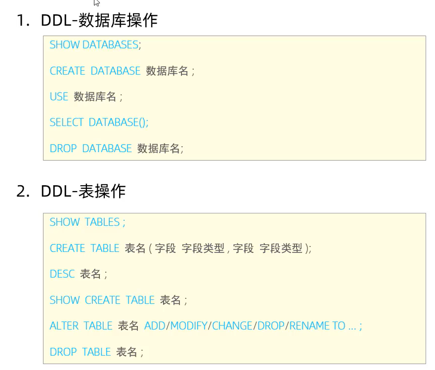

[toc]
# sql语句基础操作

## mysql ddl语句 数据库定义语言

## mysql dml 数据操纵语言
 
## mysql dql 数据库查询语言

### 一. select子句，where字句，join，having
1.查询整个表的内容：select * from xxx
 - 也可以选择表的xx内容，比如说，select name,number from xs;
2. 表连接 join
- join 有 inner join ， left join ， outer join ，right join，默认为inner join
- **inner join 的原理，两个表的某些列相等，然后经过一个判断，就可以把两个表连接在一起。**
- 例 查找xscj数据库中，性别为男，专业名为计算机的姓名，课程号，成绩
- 在这个例题中，我们知道，性别，专业名在学生表，课程号在kc，成绩在xs_kc,所以我们要展示这个表的话的，就要把相同的元素，结合来判断
  select name,coursen,pname,score,sex
  from xs join xs_kc on xs.number = xs.number
  join kc on kc.coursenum1 = xs_kc.coursenum
  where xs.pname = '计算机'
  and kc.coursen = '计算机基础'
  and xs.sex = '1'
  and xs_kc.score>90;
- 因为细写实在是太麻烦了，就放个操作让看笔记的我自行领会叭
### 二 . group by,order by语句,
- group by 的作用是把表里面的列(唯一列)，提出来。作用和distinct相似，但是group by 通常是结合聚合函数进行一个计算的过程。
- 比如
- select sex from xs
- 和 select distinct sex from xs 输出结果是一样的
- 
- group by 语句通常和聚合函数结合
- 聚合函数:
- AVG() - 返回集合的平均值。
- COUNT() - 返回集合中的项目数。
- MAX() - 返回集合中的最大值。
- MIN() - 返回集合中的最小值
- SUM() - 返回集合中所有或不同值的总和。
- 例如
- select coursen, count(*) as 总人数
  from kc
  join xs_kc on xs_kc.coursenum = kc.coursenum1
  group by coursen;
- 
- 在这里的话，group by把coursen的数据，列出来,然后通过count函数将数据统计并显现出来。
- **order by**语句
- 顾名思义，对列排序啦，分为升序和降序，默认升序，在后面加desc就是降序
- 

## mysql dcl
### grant 语句
### revoke
##mysql 视图
- 视图的话就是，把表的内容呈现出来
- 语法 create or replace view xxx as 
      from table 
      where xxx
      with check option;
- with check option 是为了确保创造出来的视图的元素可以更新。
- 查询方法和表一样 select * from;
## mysql 增加的语言元素 常量，变量，运算符，函数
### 常量
- 常量包括 字符串常量，数字常量，十六进制常量，bool常量，位字段常量，日期常量，null
- 字符串常量
- 字符串常量形如'hello’
- 想要查看有双引号的字符串的方法：select '\"hello\"','"hello"';
- 数值常量 经典 int double float
- 十六进制常量
- 形如0x41 这样子的就是十六进制常量
- cast(xxx,as unsigned) 字符串转数字 = to_string()
- select 0x41,cast(0x41 as unsigned );
- hex(number) 数字转字符串
### 函数
#### 字符串函数
- concat(c1,c2,c3) 字符串结合在一起，等价于string的加减
- select length('ssss') 获取字符串长度
- 