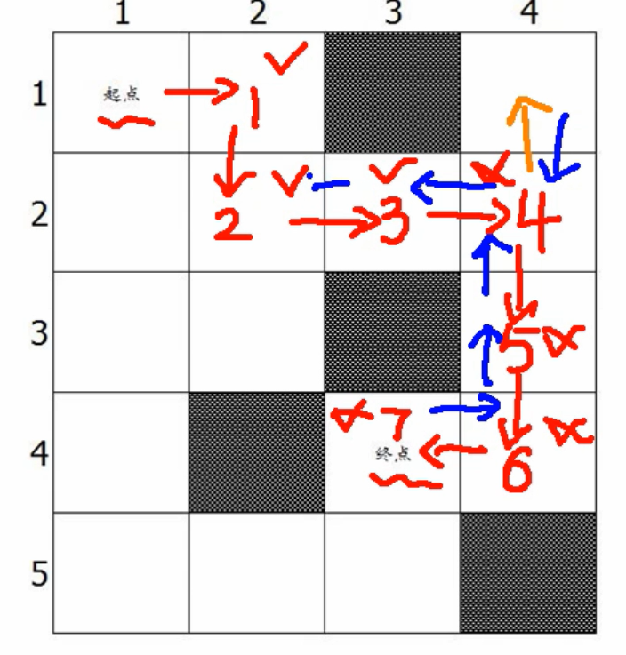

[toc]
##stl里的全排列
```C++ {.line-numbers} 

#include <bits/stdc++.h>
using namespace std;
typedef long long ll;
int main()
{   int i,j;
    int a[3] = {1,2,3};
    do
    {
        cout << a[0] << " " << a[1] << " " << a[2] << " ";
        cout << endl;
    } while (next_permutation(a, a + 3));
}

用dfs实现
int path[10], i, j;
bool s[10]; //默认为0
int n;
void dfs(int u)//u代表访问的层数
{
    if(u==n)//返回条件，一直遍历到最后一层，返回输出
    {
        for(i = 0;i<n;i++)
            {
                printf("%d ",path[i]);
            }
            cout<<endl;
            return;//
    }
        for(i = 1;i<=n;i++)
        {
            if(!s[i])//if(s[i]==false)
            {
                path[u] = i;//第一层赋值
                s[i] = true;//标记为有
                dfs(u+1);
                s[i] = false;//重新回溯的时候，把数字从新的开始，比如1轮完了轮2
            }
        }
}
```
###经典的迷宫问题
#####找最短路问题
- 解题思路,比如在一个10x10的迷宫里面，起始坐标是(0,0),重点是(5,4),要求找到一条最短的路
- 
- 如同所示,那么要想实现这玩意的话,就得用回溯了,在一次次的走和实验中,发现最短路
```C++ {.line-numbers} 
int x, y, x1, y1, step = 0;
int minn = 999999;
int a[100][100]; // 1表示空地可走,2表示有障碍物.
int v[100][100]; // 0 表示未访问,1表示已访问,全局变量默认0
void dfs(int x, int y, int step)
{
    if (x == x1 && y == y1)
    {
        if (step < minn)
            minn = step;
        return; //开始回溯
    }
    /*顺时针运动,要明白,因为二维数组,向右移动改变的是竖列,即y在变
    /*right*/
    //判断能不能往右走
    if (a[x][y + 1] == 1 && v[x][y + 1] == 0)
    {
        v[x][y + 1] = 1; //走过就标记已访问
        dfs(x, y + 1, step + 1);
        v[x][y + 1] = 0; //等到回溯的时候,就可以用了，因为是往下走,那么你走过的点,标记为未走过就行了
    }
    /*down*/
    if (a[x + 1][y] == 1 && v[x + 1][y] == 0)
    {
        v[x + 1][y] = 0;
        dfs(x + 1, y, step + 1);
        v[x + 1][y] = 1;
    }
    /*left*/
    if (a[x][y - 1] == 1 && v[x + 1][y - 1] == 0)
    {
        v[x][y - 1] = 0;
        dfs(x, y - 1, step + 1);
        v[x][y - 1] = 1;
    }
    /*up*/
    if (a[x - 1][y - 1] == 1 && v[x - 1][y - 1] == 0)
    {
        v[x - 1][y - 1] = 0;
        dfs(x - 1, y - 1, step + 1);
        v[x - 1][y - 1] = 1;
    }
    return;
}
int main()
{
    int m, n;
    int xstart, ystart;
    cin >> m >> n;
    for (int i = 0; i < m; i++)
        for (int j = 0; j < n; j++)
        {
            cin >> a[i][j];
        }
    cin >> xstart >> ystart >> x1 >> y1;
    dfs(xstart, ystart, 0);
    cout << minn;
}
```


####排列选数问题
```C++ {.line-numbers} 
#include <bits/stdc++.h>
using namespace std;
typedef long long ll;
bool v[10000];
int n, m, i, j, sum = 0,k;
bool isprime(int n)
{
   for (i = 2; i <= sqrt(n); i++)
   {
      if (n % i == 0)
         return false;
   }
   return true;
}
int a[25];
long long ans;
void dfs(int m, int sum, int startx)
{
   if (m == k)
   {
      if (isprime(sum))
         ans++;
      return;
   }
   for (int i = startx; i < n; i++)
      dfs(m + 1, sum + a[i], i + 1);
   return;
}
int main()
{
   scanf("%d%d", &n, &k);
   for (int i = 0; i < n; i++)
      scanf("%d", &a[i]);
   dfs(0, 0, 0);
   printf("%d\n", ans);
   return 0;
}

```